# 🧠 The Complete LLD Handbook — OOP Fundamentals + All 23 GoF Design Patterns (Java)

> A single, searchable file. Start at the fundamentals, end at the patterns.
> Every pattern has: **the problem → a diagram → runnable Java → when to use → traps → where it lives in the JDK**.
> Pattern taxonomy follows [refactoring.guru/design-patterns](https://refactoring.guru/design-patterns).

**How to use this file:** `Ctrl+F` the pattern name, or the phrase *"when to use"*, or *"Interview"*.

---

## 📑 Table of Contents

**PART A — Fundamentals**
1. [Why patterns exist](#1-why-patterns-exist)
2. [OOP in 5 minutes](#2-oop-in-5-minutes)
3. [The 4 Pillars of OOP](#3-the-4-pillars-of-oop)
4. [Composition vs Inheritance](#4-composition-vs-inheritance--the-single-most-tested-idea)
5. [Interface vs Abstract Class](#5-interface-vs-abstract-class)
6. [Coupling, Cohesion & the two big principles](#6-coupling-cohesion--the-two-principles-behind-every-pattern)
7. [SOLID with before/after code](#7-solid--with-beforeafter-code)
8. [Other principles: DRY, KISS, YAGNI, LoD, GRASP](#8-other-principles-you-should-name-drop)
9. [Java essentials for LLD](#9-java-essentials-you-must-know-for-lld)
10. [UML you actually need](#10-uml-you-actually-need-in-an-interview)
11. [How to attack any LLD interview (framework)](#11-how-to-attack-any-lld-interview--a-repeatable-framework)

**PART B — Patterns**
12. [Pattern map & cheat sheet](#12-the-pattern-map)
13. [🏗️ Creational Patterns](#creational) — [Singleton](#131-singleton) · [Factory Method](#132-factory-method) · [Abstract Factory](#133-abstract-factory) · [Builder](#134-builder) · [Prototype](#135-prototype)
14. [🧱 Structural Patterns](#structural) — [Adapter](#141-adapter) · [Bridge](#142-bridge) · [Composite](#143-composite) · [Decorator](#144-decorator) · [Facade](#145-facade) · [Flyweight](#146-flyweight) · [Proxy](#147-proxy)
15. [🔁 Behavioural Patterns](#behavioural) — [Chain of Responsibility](#151-chain-of-responsibility) · [Command](#152-command) · [Iterator](#153-iterator) · [Mediator](#154-mediator) · [Memento](#155-memento) · [Observer](#156-observer) · [State](#157-state) · [Strategy](#158-strategy) · [Template Method](#159-template-method) · [Visitor](#1510-visitor) · [Interpreter](#1511-interpreter)

**PART C — Interview Prep**
16. [Look-alike patterns compared](#16-look-alike-patterns--the-questions-that-trip-people-up)
17. [Pattern selection decision tree](#17-pattern-selection-decision-tree)
18. [Patterns in the JDK & Spring](#18-patterns-hiding-in-the-jdk--spring)
19. [Concurrency basics for LLD](#19-concurrency-basics-for-lld)
20. [Anti-patterns & pattern abuse](#20-anti-patterns--pattern-abuse)
21. [Classic LLD problems + which patterns to use](#21-classic-lld-problems--which-patterns-they-want)
22. [One-page revision sheet](#22-one-page-revision-sheet)

---
---

# PART A — FUNDAMENTALS

## 1. Why patterns exist

A **design pattern** is not code you copy. It is a *named, reusable solution shape* for a problem that keeps recurring.

```
         Problem you hit               Pattern = the shape of the fix
   ───────────────────────────     ─────────────────────────────────────
   "new XyzImpl() is sprinkled     → move creation behind an interface
    across 40 files"                 (Factory / Abstract Factory)

   "one class has 12 if/else        → make each branch an object
    branches on a 'type' field"       (Strategy / State)

   "I need to add behaviour but     → wrap the object
    can't touch the class"            (Decorator / Proxy)

   "two libraries speak             → translate between them
    different languages"              (Adapter)
```

**Three reasons interviewers care:**
1. **Vocabulary** — "I'd use a Strategy here" replaces 3 minutes of explanation.
2. **Extensibility** — patterns are the mechanics of "add a feature without editing old code."
3. **Judgement** — knowing when *not* to use one is a senior signal.

> ⚠️ **The #1 mistake:** starting with a pattern. Patterns are *discovered* while refactoring toward a principle (usually SOLID), not chosen up front.

---

## 2. OOP in 5 minutes

**Object-Oriented Programming** = model your program as *objects* that own **data** (state) and **behaviour** (methods), and talk to each other by sending messages (method calls).

```
        CLASS (blueprint)                    OBJECTS (instances)
  ┌───────────────────────────┐        ┌──────────────┐ ┌──────────────┐
  │  class BankAccount        │        │ acc1         │ │ acc2         │
  │  ─────────────────────    │  new   │ id=  "A-1"   │ │ id=  "A-2"   │
  │  - id: String             │ ─────▶ │ bal= 500.00  │ │ bal= 12.75   │
  │  - balance: BigDecimal    │        └──────────────┘ └──────────────┘
  │  ─────────────────────    │          same behaviour, different state
  │  + deposit(amount)        │
  │  + withdraw(amount)       │
  └───────────────────────────┘
```

```java
public class BankAccount {
    private final String id;          // state (data)
    private BigDecimal balance;       // state (data)

    public BankAccount(String id, BigDecimal opening) {
        this.id = id;
        this.balance = opening;
    }

    public void deposit(BigDecimal amount) {          // behaviour
        require(amount.signum() > 0, "amount must be > 0");
        balance = balance.add(amount);
    }

    public void withdraw(BigDecimal amount) {         // behaviour + invariant
        require(amount.compareTo(balance) <= 0, "insufficient funds");
        balance = balance.subtract(amount);
    }

    public BigDecimal balance() { return balance; }   // read-only exposure

    private static void require(boolean ok, String msg) {
        if (!ok) throw new IllegalArgumentException(msg);
    }
}
```

**The core mental shift:** in procedural code, data is dumb and functions act on it. In OOP, the object *guards its own rules*. `balance` can never go negative because the only door into it is `withdraw()`.

| Term | Meaning | One-liner |
|---|---|---|
| **Class** | Blueprint | `class Car {}` |
| **Object** | Instance in memory | `new Car()` |
| **Field / attribute** | Data an object holds | `private int speed;` |
| **Method** | Behaviour | `void accelerate()` |
| **Constructor** | Sets up a valid object | `Car(String model)` |
| **Message passing** | Calling a method on another object | `engine.start()` |
| **Invariant** | A rule that must always hold | `balance >= 0` |

---

## 3. The 4 Pillars of OOP

```
                    ┌────────────────────────────────────┐
                    │              OOP                   │
                    └────────────────────────────────────┘
                        │        │        │        │
             ┌──────────┘        │        │        └──────────┐
             ▼                   ▼        ▼                   ▼
      ENCAPSULATION        ABSTRACTION  INHERITANCE     POLYMORPHISM
      "hide the how"       "show the    "reuse the      "one interface,
                            what"        shape"          many forms"
```

### 3.1 Encapsulation — *bundle data + behaviour, hide internals*

Keep fields `private`. Expose only intentional operations. This is what lets you change the inside without breaking callers.

```java
// ❌ Anemic + leaky: anyone can corrupt state
class Cart {
    public List<Item> items = new ArrayList<>();   // caller can clear() it, add nulls...
    public double total;                            // can drift out of sync with items
}

// ✅ Encapsulated: the class owns its invariants
class Cart {
    private final List<Item> items = new ArrayList<>();

    public void add(Item item) {
        Objects.requireNonNull(item);
        items.add(item);
    }

    public List<Item> items() {
        return List.copyOf(items);     // defensive copy — callers can't mutate my state
    }

    public Money total() {             // derived, so it can never be stale
        return items.stream().map(Item::price).reduce(Money.ZERO, Money::add);
    }
}
```

> 🎯 **Interview line:** "Encapsulation isn't getters and setters — a setter for every field is just a public field with extra steps. It's exposing *operations* (`cart.add(item)`), not *data* (`cart.getItems().add(item)`)."

### 3.2 Abstraction — *expose the what, hide the how*

```java
interface PaymentGateway {                 // WHAT the system needs
    PaymentResult charge(Money amount, Card card);
}

class StripeGateway implements PaymentGateway { /* HTTP, retries, signing... */ }
class RazorpayGateway implements PaymentGateway { /* completely different HOW */ }

class CheckoutService {
    private final PaymentGateway gateway;   // depends on the idea, not the vendor
    CheckoutService(PaymentGateway gateway) { this.gateway = gateway; }
}
```

Encapsulation hides *data*; abstraction hides *complexity/implementation*. You drive a car with a steering wheel (abstraction) and can't reach into the gearbox (encapsulation).

### 3.3 Inheritance — *an "IS-A" relationship*

```java
abstract class Employee {
    protected final String name;
    protected Employee(String name) { this.name = name; }
    abstract Money monthlyPay();
    public String badge() { return "EMP:" + name; }   // shared, inherited as-is
}

class SalariedEmployee extends Employee {
    private final Money annual;
    SalariedEmployee(String n, Money annual) { super(n); this.annual = annual; }
    @Override Money monthlyPay() { return annual.divide(12); }
}

class HourlyEmployee extends Employee {
    private final Money rate; private final int hours;
    HourlyEmployee(String n, Money rate, int hours) { super(n); this.rate = rate; this.hours = hours; }
    @Override Money monthlyPay() { return rate.times(hours); }
}
```

**Liskov test before you `extends`:** can a `SalariedEmployee` be used *anywhere* an `Employee` is expected without surprising anyone? If not, don't inherit.

### 3.4 Polymorphism — *one interface, many implementations*

Two kinds:

| Kind | Also called | Resolved | Example |
|---|---|---|---|
| **Compile-time** | Overloading, static binding | at compile time | `print(int)` vs `print(String)` |
| **Runtime** | Overriding, dynamic dispatch | at run time | `Employee e = new HourlyEmployee(); e.monthlyPay();` |

```java
List<Employee> staff = List.of(
    new SalariedEmployee("Ada", Money.of(120_000)),
    new HourlyEmployee("Linus", Money.of(50), 160)
);

// The caller has ZERO if/else. The JVM picks the right method per object.
Money payroll = staff.stream()
                     .map(Employee::monthlyPay)
                     .reduce(Money.ZERO, Money::add);
```

> 🎯 **Runtime polymorphism is the engine of every behavioural pattern.** Strategy, State, Command, Visitor, Template Method — all of them are "replace `if/else` with dynamic dispatch."

---

## 4. Composition vs Inheritance — the single most tested idea

```
   INHERITANCE  (IS-A)                    COMPOSITION (HAS-A)
   ───────────────────                    ───────────────────
        Bird                                    Bird
         ▲                                       │ has
    ┌────┴────┐                                  ▼
  Sparrow  Penguin ← 💥 can't fly            FlyBehaviour  (interface)
   (inherits fly())                          ├── FlapWings
                                             ├── Glide
   Compile-time, permanent,                  └── CannotFly
   1 parent only, breaks on
   exceptions to the rule            Runtime-swappable, many behaviours,
                                     no fragile base class
```

```java
// ❌ Inheritance forces every bird to fly
class Bird { void fly() { System.out.println("flap flap"); } }
class Penguin extends Bird {
    @Override void fly() { throw new UnsupportedOperationException(); } // LSP violation!
}

// ✅ Composition: behaviour is a plug-in part  (this IS the Strategy pattern)
interface FlyBehaviour { void fly(); }
class FlapWings  implements FlyBehaviour { public void fly() { System.out.println("flap flap"); } }
class CannotFly  implements FlyBehaviour { public void fly() { System.out.println("I swim instead"); } }

class Bird {
    private FlyBehaviour flyBehaviour;                      // HAS-A
    Bird(FlyBehaviour f) { this.flyBehaviour = f; }
    void setFlyBehaviour(FlyBehaviour f) { this.flyBehaviour = f; }  // change at RUNTIME
    void performFly() { flyBehaviour.fly(); }
}

new Bird(new CannotFly()).performFly();   // penguin, no exception, no lies
```

### The three "HAS-A" flavours (know the difference — it's a classic UML question)

| Relationship | Lifetime | UML arrow | Example |
|---|---|---|---|
| **Association** | Independent | plain line `──▶` | `Student` ↔ `Course` |
| **Aggregation** | Part can outlive whole | hollow diamond `◇──` | `Department` has `Professors` |
| **Composition** | Part dies with whole | filled diamond `◆──` | `House` has `Rooms`; `Order` has `OrderLines` |

> 🎯 **Say this in interviews:** *"Favour composition over inheritance."* — Gang of Four, page 20. Use inheritance only for genuine IS-A with no exceptions; use composition for "can do", "has a", or anything that might vary at runtime.

---

## 5. Interface vs Abstract Class

```java
interface Playable {                      // a CONTRACT / capability
    void play();                          // implicitly public abstract
    default void pause() {                // Java 8+: shared default behaviour
        System.out.println("paused");
    }
    static Playable silent() { return () -> {}; }   // static factory
    int MAX_VOLUME = 100;                 // implicitly public static final
}

abstract class MediaFile implements Playable {   // shared STATE + partial implementation
    protected final String path;                 // interfaces cannot hold mutable state
    protected MediaFile(String path) { this.path = path; }
    protected abstract void decode();            // subclasses must supply
    public void play() { decode(); System.out.println("playing " + path); }
}
```

| | **Interface** | **Abstract Class** |
|---|---|---|
| Purpose | *Capability* — "can do" | *Partial implementation* — "is a kind of" |
| Multiple? | ✅ implement many | ❌ extend one |
| State | Only `public static final` constants | Any fields, mutable state |
| Constructors | ❌ | ✅ |
| Access modifiers | public (or private helpers, Java 9+) | any |
| Use when | Many unrelated classes share a capability; you want max flexibility | Related classes share code *and* state |

**Rule of thumb:** *Program to an interface; use an abstract class only to remove duplication among the implementations.*

```java
// Real-world combo you'll see everywhere:
interface Repository<T, ID> { Optional<T> findById(ID id); void save(T entity); }
abstract class JdbcRepository<T, ID> implements Repository<T, ID> { /* shared connection plumbing */ }
class UserRepository extends JdbcRepository<User, Long> { /* only the User-specific bits */ }
```

---

## 6. Coupling, Cohesion & the two principles behind every pattern

```
   HIGH COUPLING (bad)                     LOW COUPLING (good)
   A ──▶ B ──▶ C ──▶ D                     A ──▶ │IFace│ ◀── B, C, D
   change D  ⇒  rebuild+retest A           swap implementations freely

   LOW COHESION (bad)                      HIGH COHESION (good)
   ┌───────────────────┐                   ┌──────────┐ ┌──────────┐
   │ UserManager       │                   │ UserRepo │ │ Emailer  │
   │ save() email()    │        ──▶        └──────────┘ └──────────┘
   │ pdf() validate()  │                   ┌──────────┐ ┌──────────┐
   └───────────────────┘                   │ PdfGen   │ │ Validator│
     does everything                       └──────────┘ └──────────┘
```

- **Coupling** = how much one class depends on another's *details*. Aim **low**.
- **Cohesion** = how focused a class is on one job. Aim **high**.

Almost every pattern is a trick to lower coupling. Two principles do most of the work:

### 6.1 Program to an interface, not an implementation

```java
// ❌ coupled to the concrete type
ArrayList<Order> orders = new ArrayList<>();
MySqlOrderRepo repo = new MySqlOrderRepo();

// ✅ coupled only to the abstraction
List<Order> orders = new ArrayList<>();
OrderRepository repo = new MySqlOrderRepo();   // swap to Mongo/InMemory with one line
```

### 6.2 Encapsulate what varies

Find the part of your system that changes for every new requirement, and put it behind its own abstraction. That's it — that's the seed of Strategy, State, Factory, Bridge, Decorator, and Visitor.

---

## 7. SOLID — with before/after code

> **Memorize the acronym expansion + one sentence + one code smell each.** This is asked in ~every LLD interview.

```
 S  Single Responsibility   → one reason to change
 O  Open/Closed             → open for extension, closed for modification
 L  Liskov Substitution     → subtypes must be usable as their base type
 I  Interface Segregation   → many small interfaces > one fat one
 D  Dependency Inversion    → depend on abstractions, not concretions
```

### S — Single Responsibility Principle
*A class should have only one reason to change.*

```java
// ❌ three reasons to change: invoice math, DB schema, email templates
class Invoice {
    void calculateTotal() {}
    void saveToDatabase() {}
    void emailToCustomer() {}
}

// ✅ each class changes for exactly one reason
class Invoice          { Money calculateTotal() { ... } }
class InvoiceRepository{ void save(Invoice i)   { ... } }
class InvoiceMailer    { void send(Invoice i)   { ... } }
```
**Smell:** the class name contains "And", or you can't describe it without "also".

### O — Open/Closed Principle
*Open for extension, closed for modification.*

```java
// ❌ every new shape edits this switch — and risks breaking the old ones
class AreaCalculator {
    double area(Object shape) {
        if (shape instanceof Circle c)      return Math.PI * c.r * c.r;
        else if (shape instanceof Square s) return s.side * s.side;
        // add Triangle → must EDIT this class again
        throw new IllegalArgumentException();
    }
}

// ✅ new shapes just ADD a class; AreaCalculator never changes again
interface Shape { double area(); }
record Circle(double r)    implements Shape { public double area() { return Math.PI * r * r; } }
record Square(double side) implements Shape { public double area() { return side * side; } }
record Triangle(double b, double h) implements Shape { public double area() { return 0.5 * b * h; } }

class AreaCalculator {
    double total(List<Shape> shapes) {
        return shapes.stream().mapToDouble(Shape::area).sum();
    }
}
```
**Smell:** a `switch`/`if-else` chain on a type field that grows with every feature.

### L — Liskov Substitution Principle
*If S is a subtype of T, an S must work anywhere a T is expected.*

```java
// ❌ classic violation — Square breaks Rectangle's contract
class Rectangle {
    protected int w, h;
    void setWidth(int w)  { this.w = w; }
    void setHeight(int h) { this.h = h; }
    int area() { return w * h; }
}
class Square extends Rectangle {
    @Override void setWidth(int w)  { this.w = w; this.h = w; }   // surprise side effect
    @Override void setHeight(int h) { this.w = h; this.h = h; }
}

void clientCode(Rectangle r) {
    r.setWidth(5); r.setHeight(4);
    assert r.area() == 20;    // 💥 fails for Square (returns 16)
}

// ✅ don't force a false IS-A; model them as siblings
interface Shape { int area(); }
record Rectangle(int w, int h) implements Shape { public int area() { return w * h; } }
record Square(int side)        implements Shape { public int area() { return side * side; } }
```
**Smells:** overriding a method to throw `UnsupportedOperationException`; a subclass strengthening preconditions or weakening postconditions; `if (obj instanceof SubType)` in client code.

### I — Interface Segregation Principle
*No client should be forced to depend on methods it doesn't use.*

```java
// ❌ fat interface — a scanner is forced to implement printing and faxing
interface MultiFunctionDevice { void print(Doc d); void scan(Doc d); void fax(Doc d); }
class SimpleScanner implements MultiFunctionDevice {
    public void print(Doc d) { throw new UnsupportedOperationException(); }  // 🚩
    public void fax(Doc d)   { throw new UnsupportedOperationException(); }
    public void scan(Doc d)  { /* the only real one */ }
}

// ✅ small, role-based interfaces
interface Printer { void print(Doc d); }
interface Scanner { void scan(Doc d); }
interface Fax     { void fax(Doc d);   }

class SimpleScanner implements Scanner { public void scan(Doc d) { ... } }
class OfficeMachine implements Printer, Scanner, Fax { ... }
```
**Smell:** empty method bodies or `UnsupportedOperationException` in implementations.

### D — Dependency Inversion Principle
*High-level modules shouldn't depend on low-level modules. Both should depend on abstractions.*

```
      ❌ BEFORE                          ✅ AFTER
   ┌──────────────┐                 ┌──────────────┐
   │ OrderService │ (high level)    │ OrderService │
   └──────┬───────┘                 └──────┬───────┘
          │ new                            │ depends on
          ▼                                ▼
   ┌──────────────┐                 ┌──────────────────┐
   │  MySqlRepo   │ (low level)     │ «interface»      │
   └──────────────┘                 │ OrderRepository  │
                                    └────────▲─────────┘
   direction of dependency                   │ implements
   follows the call                  ┌───────┴────────┐
                                     │   MySqlRepo    │  ← arrow INVERTED
                                     └────────────────┘
```

```java
// ❌ high-level policy welded to a low-level detail
class OrderService {
    private final MySqlOrderRepo repo = new MySqlOrderRepo();   // can't test, can't swap
}

// ✅ both sides depend on the abstraction; wiring happens outside
interface OrderRepository { void save(Order o); }
class MySqlOrderRepo   implements OrderRepository { ... }
class InMemoryOrderRepo implements OrderRepository { ... }   // perfect for unit tests

class OrderService {
    private final OrderRepository repo;
    OrderService(OrderRepository repo) { this.repo = repo; }   // constructor injection
}
```
**Smell:** `new SomeConcreteService()` inside business logic. **Fix:** inject it (this is literally what Spring's `@Autowired` does).

> 🎯 **Interview gold:** "DIP is *why* Dependency Injection frameworks exist. DI is the mechanism; DIP is the principle."

---

## 8. Other principles you should name-drop

| Principle | Meaning | Watch out |
|---|---|---|
| **DRY** — Don't Repeat Yourself | Every piece of knowledge has one authoritative home | Don't DRY up *coincidentally* similar code — that creates false coupling |
| **KISS** — Keep It Simple | Simplest thing that works | A pattern that adds 4 classes to save 1 `if` is a loss |
| **YAGNI** — You Aren't Gonna Need It | Don't build for imagined futures | Balance against OCP: extend when the 2nd variant *actually* arrives |
| **Law of Demeter** ("don't talk to strangers") | Only call methods on: yourself, your fields, your params, objects you created | `order.getCustomer().getAddress().getCity().getName()` 🚩 → `order.shippingCity()` |
| **Composition over Inheritance** | Prefer HAS-A | See §4 |
| **Tell, Don't Ask** | Send commands, don't pull data out to decide | `account.withdraw(x)` not `if (account.getBalance() > x) account.setBalance(...)` |
| **Separation of Concerns** | Layers: Controller → Service → Repository → Model | Business logic in a controller is a classic red flag |

**GRASP** (a nice bonus to mention): *Information Expert* (give the job to the class that has the data), *Creator*, *Controller*, *Low Coupling*, *High Cohesion*, *Polymorphism*, *Pure Fabrication*, *Indirection*, *Protected Variations*.

---

## 9. Java essentials you must know for LLD

### 9.1 `equals` + `hashCode` — always together

Any object you put in a `HashMap`/`HashSet` needs both, or lookups silently fail.

```java
public final class UserId {
    private final String value;
    public UserId(String value) { this.value = Objects.requireNonNull(value); }

    @Override public boolean equals(Object o) {
        if (this == o) return true;
        if (!(o instanceof UserId other)) return false;
        return value.equals(other.value);
    }
    @Override public int hashCode() { return Objects.hash(value); }
    @Override public String toString() { return "UserId[" + value + "]"; }
}
```
**Contract:** equal objects ⇒ equal hash codes. (The reverse need not hold.) Never build `hashCode` from mutable fields you then mutate while the object sits in a set.

**Java 16+ shortcut:** a `record` generates `equals`, `hashCode`, `toString`, and accessors for you.
```java
public record UserId(String value) { }   // done
public record Point(int x, int y) { }
```

### 9.2 Immutability — your best concurrency tool

```java
public final class Money {                       // final: no subclass can break it
    private final BigDecimal amount;             // final fields
    private final Currency currency;

    public Money(BigDecimal amount, Currency currency) { ... }

    public Money add(Money other) {              // returns a NEW object, never mutates
        checkSameCurrency(other);
        return new Money(amount.add(other.amount), currency);
    }
}
```
Immutable objects are automatically thread-safe, safe as `Map` keys, and safe to share/cache. **Checklist:** class `final`, fields `private final`, no setters, defensive-copy mutable inputs *and* outputs.

### 9.3 Enums — more powerful than you think

```java
public enum OrderStatus {
    CREATED   { public boolean canTransitionTo(OrderStatus s) { return s == PAID || s == CANCELLED; } },
    PAID      { public boolean canTransitionTo(OrderStatus s) { return s == SHIPPED || s == REFUNDED; } },
    SHIPPED   { public boolean canTransitionTo(OrderStatus s) { return s == DELIVERED; } },
    DELIVERED { public boolean canTransitionTo(OrderStatus s) { return false; } },
    CANCELLED { public boolean canTransitionTo(OrderStatus s) { return false; } },
    REFUNDED  { public boolean canTransitionTo(OrderStatus s) { return false; } };

    public abstract boolean canTransitionTo(OrderStatus next);
}
```
Enums are singletons by construction (see §13.1), can implement interfaces, and can hold per-constant behaviour — a compact State machine.

### 9.4 Generics — type-safe reuse

```java
interface Repository<T, ID> {
    Optional<T> findById(ID id);
    List<T> findAll();
    T save(T entity);
}

// bounded types
static <T extends Comparable<T>> T max(List<T> list) { ... }

// PECS: Producer Extends, Consumer Super
static void copy(List<? extends Number> src, List<? super Number> dst) { ... }
```

### 9.5 Functional interfaces & lambdas (patterns get 5× shorter)

| Interface | Shape | Use |
|---|---|---|
| `Supplier<T>` | `() -> T` | lazy creation, factories |
| `Consumer<T>` | `T -> void` | observers, callbacks |
| `Function<T,R>` | `T -> R` | transformations, strategies |
| `Predicate<T>` | `T -> boolean` | filters, specifications |
| `Runnable` | `() -> void` | commands |
| `BiFunction<T,U,R>` | `(T,U) -> R` | two-arg strategies |

```java
// A whole Strategy pattern in one line, because the interface has one method:
Function<String, String> upper = String::toUpperCase;
Comparator<Order> byDate = Comparator.comparing(Order::createdAt);
```

### 9.6 Access modifiers

| Modifier | Same class | Same package | Subclass (other pkg) | World |
|---|:---:|:---:|:---:|:---:|
| `private` | ✅ | ❌ | ❌ | ❌ |
| *(default)* | ✅ | ✅ | ❌ | ❌ |
| `protected` | ✅ | ✅ | ✅ | ❌ |
| `public` | ✅ | ✅ | ✅ | ✅ |

**Default to `private`.** Widen only when forced.

### 9.7 `static` vs instance, and `final`

```java
class Counter {
    private static int totalCreated;      // shared by ALL instances (class-level)
    private final String id;              // per-instance, assign-once
    private static final int MAX = 100;   // constant (UPPER_SNAKE by convention)
}
```
`final` on: a **field** = assign once; a **method** = can't override; a **class** = can't extend.

---

## 10. UML you actually need in an interview

You will draw a **class diagram** on a whiteboard. Learn these six arrows and nothing else.

```
  ┌──────────────────────┐
  │      ClassName       │   ← name
  ├──────────────────────┤
  │ - privateField: Type │   ← -  private
  │ # protectedField     │      #  protected
  │ + publicField        │      +  public
  │ ~ packageField       │      ~  package-private
  ├──────────────────────┤
  │ + method(p: T): R    │   ← methods
  │ + staticMethod()     │      (underlined = static)
  │ + abstractMethod()   │      (italic     = abstract)
  └──────────────────────┘
```

| Relationship | Notation | Means | Java |
|---|---|---|---|
| **Inheritance** | `◁────` solid line, hollow triangle | IS-A | `class B extends A` |
| **Realization** | `◁- - -` dashed line, hollow triangle | implements a contract | `class B implements I` |
| **Association** | `─────▶` solid arrow | "knows about", long-lived reference | field `private B b;` |
| **Aggregation** | `◇─────` hollow diamond at whole | HAS-A, part survives whole | `Team` has `Players` |
| **Composition** | `◆─────` filled diamond at whole | OWNS-A, part dies with whole | `Order` has `OrderLine` |
| **Dependency** | `- - -▶` dashed arrow | "uses temporarily" | method param / local var |

**Mermaid version (copy-paste-able, renders on GitHub):**

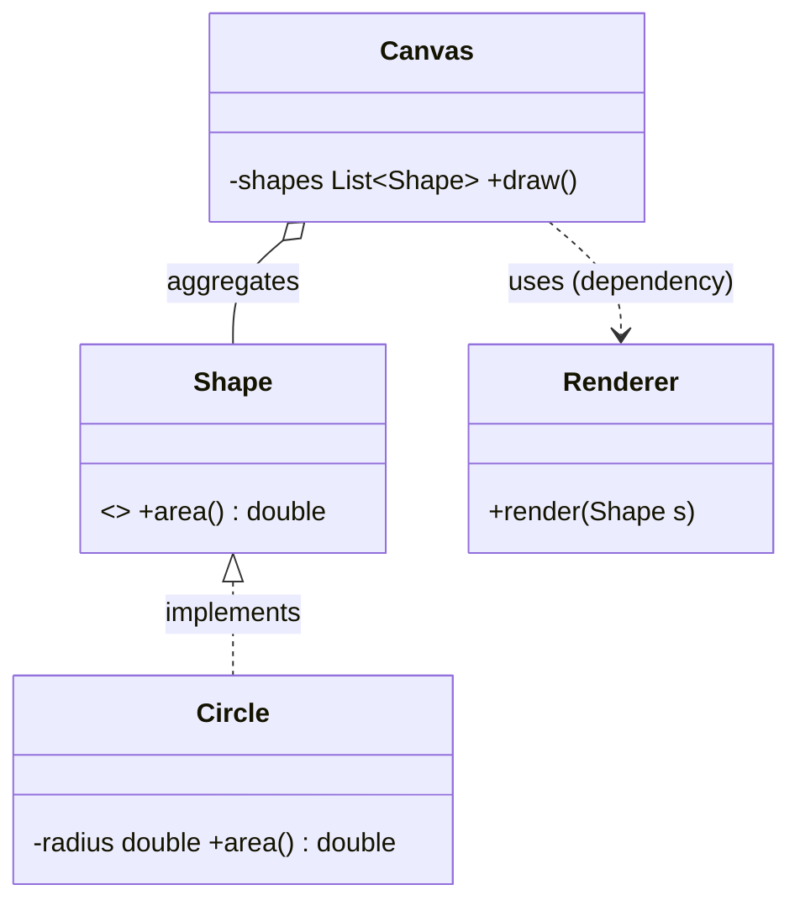
```mermaid
classDiagram
    class Shape { <<interface>> +area() double }
    class Circle { -radius double +area() double }
    class Canvas { -shapes List~Shape~ +draw() }
    class Renderer { +render(Shape s) }

    Shape <|.. Circle : implements
    Canvas o-- Shape : aggregates
    Canvas ..> Renderer : uses (dependency)
```

**Multiplicity** goes on the line ends: `1`, `0..1`, `*`, `1..*`.

> 🎯 Also worth 30 seconds of practice: a **sequence diagram** for one flow (`Client → Service → Repository → DB`), because interviewers often ask "walk me through what happens when the user clicks Pay."

---

## 11. How to attack any LLD interview — a repeatable framework

```
  1. CLARIFY (3-5 min)  ──▶  2. ENTITIES  ──▶  3. RELATIONSHIPS  ──▶  4. CLASS DIAGRAM
        │                                                                    │
        └────────────── 7. TRADE-OFFS ◀── 6. EDGE CASES ◀── 5. CODE THE CORE ┘
```

**Step 1 — Clarify & scope (never skip).**
Ask: Who are the actors? What are the must-have use cases? In-scope vs out-of-scope? Single machine or distributed? Do we need persistence, concurrency, payments? Then *state the scope back*: "So: in-memory, single JVM, 3 actors, these 5 use cases."

**Step 2 — Find the nouns → candidate classes.**
"A user parks a vehicle in a spot and gets a ticket" → `User`, `Vehicle`, `ParkingSpot`, `Ticket`, `ParkingLot`.
Prune ruthlessly: not every noun deserves a class.

**Step 3 — Find the verbs → methods, and assign them by *Information Expert*.**
"Calculate fee" → the class that owns the rate data. Don't create a `TicketManager` god class.

**Step 4 — Draw the class diagram.** Interfaces first, then concretes. Mark the relationships (§10).

**Step 5 — Code the core** (the interviewer will pick 2–3 classes). Write real, compiling Java: constructors, enums, interfaces. Skip getters/setters unless asked — say "assume standard accessors."

**Step 6 — Handle extension points explicitly.** This is where you *name patterns*:
- "Multiple pricing rules" → **Strategy**
- "Notify on status change" → **Observer**
- "Undo" → **Command + Memento**
- "Build a complex object with optional fields" → **Builder**
- "One instance of the lot" → **Singleton** (and mention the testability downside)

**Step 7 — Concurrency & edge cases.** Two cars racing for the last spot? `ConcurrentHashMap`, `AtomicInteger`, `synchronized`, or optimistic locking. Nulls, invalid transitions, empty collections.

### Interview do's and don'ts

| ✅ Do | ❌ Don't |
|---|---|
| Think out loud constantly | Go silent for 5 minutes |
| Start simple, then extend | Design for 10 unrequested features |
| Justify every pattern with the *principle* it serves | Say "I'll use Singleton" with no reason |
| Use interfaces at the seams that vary | Make every class implement an interface |
| Admit trade-offs ("Singleton hurts testability, but…") | Pretend your design is perfect |
| Ask before assuming | Assume the DB, framework, or scale |

**Time budget for a 45-min round:** 5 clarify · 10 entities+diagram · 20 code · 10 extensions & Q&A.

---
---
# PART B — THE 23 GoF DESIGN PATTERNS

## 12. The pattern map

```
┌─────────────────────────────────────────────────────────────────────────────┐
│  🏗️  CREATIONAL — "How do I create objects?"                                 │
│      Decouple the client from the concrete classes it instantiates.         │
├─────────────────────────────────────────────────────────────────────────────┤
│  Singleton         one instance, global access                              │
│  Factory Method    subclass decides which class to instantiate              │
│  Abstract Factory  create FAMILIES of related objects                       │
│  Builder           construct complex objects step by step                   │
│  Prototype         create by cloning an existing object                     │
└─────────────────────────────────────────────────────────────────────────────┘
┌─────────────────────────────────────────────────────────────────────────────┐
│  🧱  STRUCTURAL — "How do I compose objects into bigger structures?"         │
│      Assemble objects so the structure stays flexible and efficient.        │
├─────────────────────────────────────────────────────────────────────────────┤
│  Adapter    make incompatible interfaces work together                      │
│  Bridge     split abstraction from implementation (2 axes of change)        │
│  Composite  treat trees and leaves uniformly                                │
│  Decorator  add responsibilities by wrapping, at runtime                    │
│  Facade     one simple door into a complex subsystem                        │
│  Flyweight  share common state across many objects to save memory           │
│  Proxy      a stand-in that controls access to the real object              │
└─────────────────────────────────────────────────────────────────────────────┘
┌─────────────────────────────────────────────────────────────────────────────┐
│  🔁  BEHAVIOURAL — "How do objects communicate & distribute responsibility?" │
├─────────────────────────────────────────────────────────────────────────────┤
│  Chain of Responsibility  pass a request along a chain of handlers          │
│  Command                  wrap a request as an object (queue, log, undo)    │
│  Iterator                 traverse a collection without exposing internals  │
│  Mediator                 centralize chaotic many-to-many communication     │
│  Memento                  snapshot & restore state without breaking privacy │
│  Observer                 publish/subscribe on state change                 │
│  State                    behaviour changes with internal state             │
│  Strategy                 interchangeable algorithms chosen by the client   │
│  Template Method          fixed skeleton, subclasses fill the steps         │
│  Visitor                  add new operations to a class hierarchy           │
│  Interpreter              represent & evaluate a grammar                    │
└─────────────────────────────────────────────────────────────────────────────┘
```

### 30-second cheat sheet

| Pattern | One-line intent | Trigger phrase in a problem statement |
|---|---|---|
| **Singleton** | Exactly one instance | "there is only one …", config, logger, cache |
| **Factory Method** | Defer instantiation to subclasses | "create the right kind of X based on input" |
| **Abstract Factory** | Families of related products | "Windows theme vs Mac theme", "MySQL set vs Mongo set" |
| **Builder** | Step-by-step construction | telescoping constructors, many optional fields |
| **Prototype** | Clone instead of construct | expensive setup, copy/duplicate feature |
| **Adapter** | Translate interfaces | third-party/legacy integration |
| **Bridge** | Two independent dimensions | "N shapes × M renderers" class explosion |
| **Composite** | Part-whole trees | file system, org chart, UI tree, nested menus |
| **Decorator** | Wrap to add behaviour | "add toppings / compression / encryption at runtime" |
| **Facade** | Simplify a subsystem | "one method to start the whole thing" |
| **Flyweight** | Share intrinsic state | millions of similar objects, memory pressure |
| **Proxy** | Control access | lazy load, caching, access control, remote call |
| **Chain of Responsibility** | Pass down a chain | middleware, approval workflow, filters |
| **Command** | Request as an object | undo/redo, queueing, macro, transactions |
| **Iterator** | Sequential access | custom collection traversal |
| **Mediator** | Central hub | chat room, UI dialog, air traffic control |
| **Memento** | Snapshot/restore | undo, checkpoint, save game |
| **Observer** | Notify dependents | events, pub/sub, "when X happens, tell Y and Z" |
| **State** | State-dependent behaviour | vending machine, order lifecycle, TCP connection |
| **Strategy** | Swap algorithms | sorting/pricing/payment/compression options |
| **Template Method** | Skeleton + hooks | frameworks, "same steps, different details" |
| **Visitor** | New ops on a stable hierarchy | AST traversal, reporting over a fixed model |
| **Interpreter** | Evaluate a grammar | rule engines, query/expression languages |

---
---

<a id="creational"></a>

## 13. 🏗️ Creational Patterns

---

### 13.1 Singleton

> **Intent:** Ensure a class has **only one instance** and provide a global point of access to it.

#### The problem
```
   ❌ Every service makes its own connection pool / config / logger
   ┌────────┐   ┌────────┐   ┌────────┐
   │ SvcA   │   │ SvcB   │   │ SvcC   │
   └───┬────┘   └───┬────┘   └───┬────┘
       │new         │new         │new
       ▼            ▼            ▼
   [Pool #1]    [Pool #2]    [Pool #3]     ← 3× the connections, inconsistent state
```
```
   ✅ One shared instance
   ┌────────┐   ┌────────┐   ┌────────┐
   │ SvcA   │   │ SvcB   │   │ SvcC   │
   └───┬────┘   └───┬────┘   └───┬────┘
       └────────────┼────────────┘
                    ▼  getInstance()
              [ single Pool ]
```

#### Structure
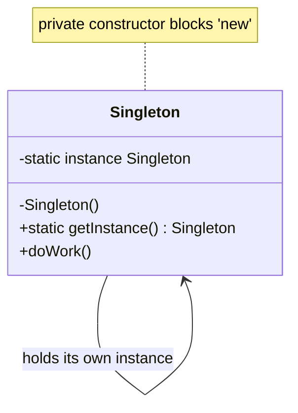
```mermaid
classDiagram
    class Singleton {
        -static instance Singleton
        -Singleton()
        +static getInstance() Singleton
        +doWork()
    }
    Singleton --> Singleton : holds its own instance
    note for Singleton "private constructor blocks 'new'"
```

#### Java — the five ways, ranked

```java
// ─────────────────────────────────────────────────────────────────
// 1️⃣ EAGER — simplest, thread-safe by classloader. Use when creation is cheap.
public class EagerLogger {
    private static final EagerLogger INSTANCE = new EagerLogger();
    private EagerLogger() {}                        // blocks `new`
    public static EagerLogger getInstance() { return INSTANCE; }
    public void log(String msg) { System.out.println("[LOG] " + msg); }
}

// ─────────────────────────────────────────────────────────────────
// 2️⃣ LAZY + synchronized — correct but locks on EVERY call. Slow.
public class LazyConfig {
    private static LazyConfig instance;
    private LazyConfig() {}
    public static synchronized LazyConfig getInstance() {
        if (instance == null) instance = new LazyConfig();
        return instance;
    }
}

// ─────────────────────────────────────────────────────────────────
// 3️⃣ DOUBLE-CHECKED LOCKING — lazy + fast. `volatile` is MANDATORY.
public class DclCache {
    private static volatile DclCache instance;      // volatile stops instruction reordering
    private DclCache() {}
    public static DclCache getInstance() {
        if (instance == null) {                     // 1st check — no lock, fast path
            synchronized (DclCache.class) {
                if (instance == null) {             // 2nd check — under lock
                    instance = new DclCache();
                }
            }
        }
        return instance;
    }
}

// ─────────────────────────────────────────────────────────────────
// 4️⃣ ⭐ BILL PUGH (initialization-on-demand holder) — lazy, thread-safe, NO locks.
//    The holder class loads only when getInstance() is first called. BEST classic idiom.
public class BillPughSingleton {
    private BillPughSingleton() {}
    private static class Holder {                   // not loaded until referenced
        private static final BillPughSingleton INSTANCE = new BillPughSingleton();
    }
    public static BillPughSingleton getInstance() { return Holder.INSTANCE; }
}

// ─────────────────────────────────────────────────────────────────
// 5️⃣ ⭐⭐ ENUM — Joshua Bloch's recommendation. Immune to reflection AND serialization attacks.
public enum AppConfig {
    INSTANCE;
    private final Map<String, String> settings = new ConcurrentHashMap<>();
    public String get(String key) { return settings.get(key); }
    public void set(String key, String value) { settings.put(key, value); }
}
// usage: AppConfig.INSTANCE.set("env", "prod");
```

#### How Singletons get broken (and fixed)
| Attack | Fix |
|---|---|
| **Reflection** — `constructor.setAccessible(true)` | throw from the constructor if instance exists, or use `enum` |
| **Serialization** — deserializing creates a 2nd object | implement `readResolve()` returning the instance, or use `enum` |
| **Cloning** | override `clone()` to throw `CloneNotSupportedException` |
| **Multiple classloaders** | each loader gets its own instance — usually accept it |

#### ✅ When to use / ❌ when not
- ✅ Logger, configuration registry, connection pool, cache, thread pool, ID generator.
- ❌ Anything holding **request-scoped or mutable business state** — that's a global variable in a costume.
- ❌ When you need to unit-test the collaborator. Prefer **one instance managed by a DI container** (`@Bean` / `@Singleton`) over a hard-coded `getInstance()`. You get the "one instance" property *without* the global coupling.

> 🎯 **Interview answer:** "I'd use Bill Pugh or enum. But note Singleton is often called an anti-pattern: it's global state, it hides dependencies, and it makes tests order-dependent. In a Spring app I'd just declare a singleton-scoped bean and inject it."

📁 *In this repo:* `src/com/java/demo/creational/singleton/`

---

### 13.2 Factory Method

> **Intent:** Define an interface for creating an object, but let **subclasses decide which class to instantiate**.

#### The problem
```
   ❌ Client welded to concrete classes
   ┌──────────┐
   │  Client  │──new MySqlConnection()──▶ 💥 adding Postgres = editing Client
   └──────────┘

   ✅ Creation moved behind a factory method
   ┌──────────┐        ┌───────────────────┐  createConnection()  ┌──────────────┐
   │  Client  │───────▶│ «abstract»        │─────────────────────▶│ «interface»  │
   └──────────┘        │ ConnectionFactory │                      │  Connection  │
                       └─────────▲─────────┘                      └──────▲───────┘
                         ┌───────┴────────┐                    ┌─────────┴────────┐
                    MySqlFactory   PostgresFactory        MySqlConn        PostgresConn
```

#### Structure
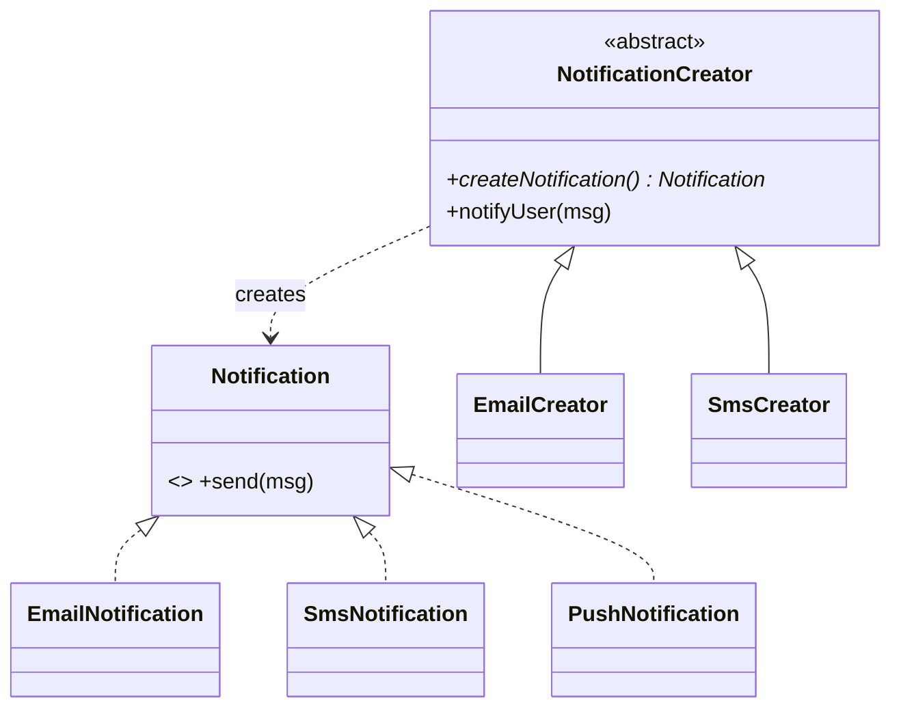
```mermaid
classDiagram
    class Notification { <<interface>> +send(msg) }
    class EmailNotification
    class SmsNotification
    class PushNotification

    class NotificationCreator {
        <<abstract>>
        +createNotification()* Notification
        +notifyUser(msg)
    }
    class EmailCreator
    class SmsCreator

    Notification <|.. EmailNotification
    Notification <|.. SmsNotification
    Notification <|.. PushNotification
    NotificationCreator <|-- EmailCreator
    NotificationCreator <|-- SmsCreator
    NotificationCreator ..> Notification : creates
```

#### Java

```java
// ---------- Product ----------
public interface Notification {
    void send(String recipient, String message);
}

public class EmailNotification implements Notification {
    public void send(String to, String msg) { System.out.println("📧 Email to " + to + ": " + msg); }
}
public class SmsNotification implements Notification {
    public void send(String to, String msg) { System.out.println("📱 SMS to " + to + ": " + msg); }
}
public class PushNotification implements Notification {
    public void send(String to, String msg) { System.out.println("🔔 Push to " + to + ": " + msg); }
}

// ---------- Creator: the factory METHOD is the abstract one ----------
public abstract class NotificationService {

    protected abstract Notification createNotification();   // ← the Factory Method

    // Template of shared logic that works with ANY product
    public void notifyUser(String recipient, String message) {
        Notification n = createNotification();
        audit(recipient);
        n.send(recipient, message);
    }

    private void audit(String recipient) { System.out.println("audit: notifying " + recipient); }
}

public class EmailService extends NotificationService {
    @Override protected Notification createNotification() { return new EmailNotification(); }
}
public class SmsService extends NotificationService {
    @Override protected Notification createNotification() { return new SmsNotification(); }
}

// ---------- Client ----------
public class Demo {
    public static void main(String[] args) {
        NotificationService service = new EmailService();   // choose the subclass, not the product
        service.notifyUser("ada@example.com", "Your order shipped");
    }
}
```

#### Variant you'll write more often: **Simple Factory** (not GoF, but universally used)

```java
public class NotificationFactory {
    public static Notification create(Channel channel) {
        return switch (channel) {
            case EMAIL -> new EmailNotification();
            case SMS   -> new SmsNotification();
            case PUSH  -> new PushNotification();
        };
    }
}
// Even better (Open/Closed): a registry, so new types register themselves
public class NotificationRegistry {
    private static final Map<Channel, Supplier<Notification>> REGISTRY = new EnumMap<>(Channel.class);
    public static void register(Channel c, Supplier<Notification> s) { REGISTRY.put(c, s); }
    public static Notification create(Channel c) {
        return Optional.ofNullable(REGISTRY.get(c))
                       .orElseThrow(() -> new IllegalArgumentException("unknown: " + c))
                       .get();
    }
}
```

#### ✅ When to use
- The exact class to create isn't known until runtime, or depends on config/input.
- You want to give library users a hook to substitute their own product type.
- You keep seeing `new ConcreteThing()` scattered through business logic.

#### ⚠️ Traps
- One subclass per product can explode the class count — use Simple Factory or a registry when the creation logic is trivial.
- A `switch` in a simple factory violates OCP; the registry/`Map<Type, Supplier>` version fixes it.

**JDK:** `Calendar.getInstance()`, `NumberFormat.getInstance()`, `ThreadFactory`, `Collection.iterator()`.

📁 *In this repo:* `src/com/java/demo/creational/factory/`

---

### 13.3 Abstract Factory

> **Intent:** Provide an interface for creating **families of related objects** without specifying their concrete classes.

**Factory Method makes one product. Abstract Factory makes a matched SET.**

#### The problem
```
   You need a whole UI kit that must MATCH:
   ❌ new WinButton() + new MacCheckbox()   ← mixed families = broken look
   ✅ factory.createButton() + factory.createCheckbox()  ← always the same family

   ┌──────────────────┐            ┌─────────────────────────────────────┐
   │      Client      │───────────▶│ «interface» GUIFactory              │
   └──────────────────┘            │  createButton() / createCheckbox()  │
                                   └──────────────┬──────────────────────┘
                       ┌──────────────────────────┴────────────────────────┐
                ┌──────▼───────┐                                    ┌──────▼───────┐
                │ WinFactory   │                                    │ MacFactory   │
                └──────┬───────┘                                    └──────┬───────┘
                       │ makes                                             │ makes
             ┌─────────┴─────────┐                             ┌───────────┴────────┐
        WinButton          WinCheckbox                    MacButton          MacCheckbox
```

#### Structure
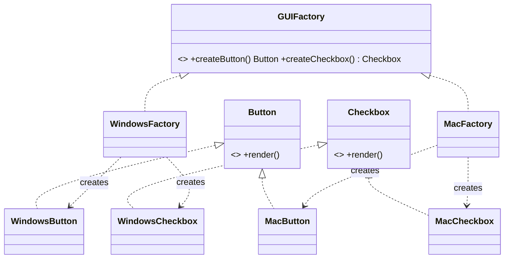
```mermaid
classDiagram
    class GUIFactory { <<interface>> +createButton() Button +createCheckbox() Checkbox }
    class WindowsFactory
    class MacFactory
    class Button { <<interface>> +render() }
    class Checkbox { <<interface>> +render() }

    GUIFactory <|.. WindowsFactory
    GUIFactory <|.. MacFactory
    Button <|.. WindowsButton
    Button <|.. MacButton
    Checkbox <|.. WindowsCheckbox
    Checkbox <|.. MacCheckbox
    WindowsFactory ..> WindowsButton : creates
    WindowsFactory ..> WindowsCheckbox : creates
    MacFactory ..> MacButton : creates
    MacFactory ..> MacCheckbox : creates
```

#### Java

```java
// ---------- Abstract products ----------
public interface Button   { void render(); void onClick(Runnable action); }
public interface Checkbox { void render(); boolean isChecked(); }

// ---------- Concrete products: family 1 (Windows) ----------
public class WindowsButton implements Button {
    public void render() { System.out.println("[ Windows Button ]"); }
    public void onClick(Runnable a) { a.run(); }
}
public class WindowsCheckbox implements Checkbox {
    public void render() { System.out.println("[x] Windows Checkbox"); }
    public boolean isChecked() { return true; }
}

// ---------- Concrete products: family 2 (macOS) ----------
public class MacButton implements Button {
    public void render() { System.out.println("( macOS Button )"); }
    public void onClick(Runnable a) { a.run(); }
}
public class MacCheckbox implements Checkbox {
    public void render() { System.out.println("☑ macOS Checkbox"); }
    public boolean isChecked() { return true; }
}

// ---------- Abstract factory ----------
public interface GUIFactory {
    Button createButton();
    Checkbox createCheckbox();
}

public class WindowsFactory implements GUIFactory {
    public Button createButton()     { return new WindowsButton();   }
    public Checkbox createCheckbox() { return new WindowsCheckbox(); }
}
public class MacFactory implements GUIFactory {
    public Button createButton()     { return new MacButton();   }
    public Checkbox createCheckbox() { return new MacCheckbox(); }
}

// ---------- Client: knows only the abstractions ----------
public class Application {
    private final Button button;
    private final Checkbox checkbox;

    public Application(GUIFactory factory) {          // family injected once
        this.button   = factory.createButton();
        this.checkbox = factory.createCheckbox();
    }
    public void renderUI() { button.render(); checkbox.render(); }

    public static void main(String[] args) {
        GUIFactory factory = System.getProperty("os.name").toLowerCase().contains("mac")
                ? new MacFactory() : new WindowsFactory();
        new Application(factory).renderUI();
    }
}
```

#### ✅ When to use
- Products come in **families that must not be mixed** (UI toolkits, DB drivers `Connection`+`Command`+`Transaction`, cloud providers `Storage`+`Queue`+`Compute`).
- You want to switch the entire family with one line.

#### ⚠️ Traps
- **Adding a new product type** (say `Slider`) means editing the factory interface *and every* implementation — that's the pattern's known weakness.
- Overkill for a single product type; use Factory Method then.

**JDK:** `DocumentBuilderFactory`, `TransformerFactory`, `javax.xml.parsers.SAXParserFactory`, `Connection` in JDBC.

---

### 13.4 Builder

> **Intent:** Construct a complex object **step by step**, so the same construction process can produce different representations. Kills the telescoping constructor.

#### The problem
```
❌ Telescoping constructors — unreadable, error-prone
new Pizza(12, "thin", true, false, true, true, false, "extra");
        //  ↑ which boolean was cheese again?

❌ JavaBeans (setters) — object is temporarily INVALID and can't be immutable
Pizza p = new Pizza(); p.setSize(12); p.setCheese(true);  // ...forgot setCrust()?

✅ Builder — named steps, validated at build(), immutable result
Pizza p = new Pizza.Builder(12)
        .crust("thin")
        .addTopping("mushroom")
        .addTopping("olive")
        .extraCheese()
        .build();
```

#### Structure
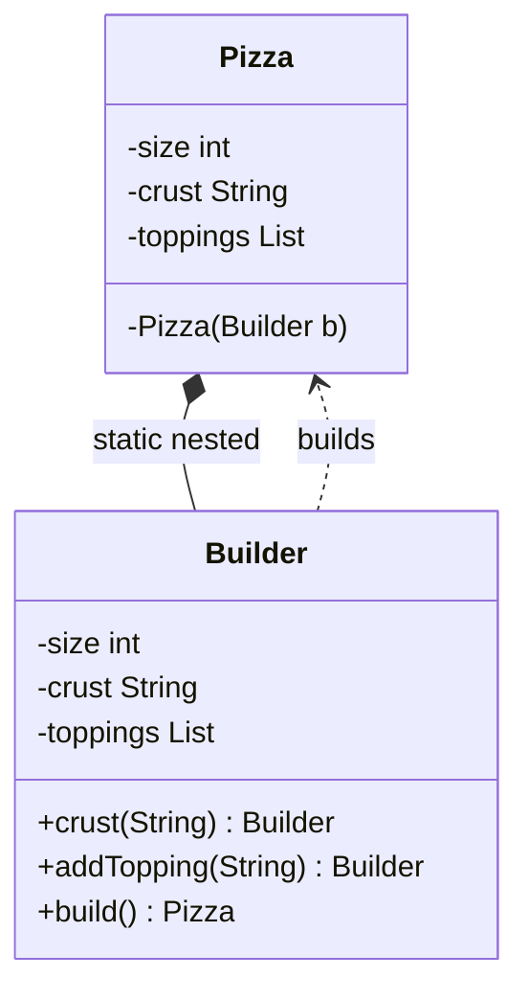
```mermaid
classDiagram
    class Pizza {
        -size int
        -crust String
        -toppings List
        -Pizza(Builder b)
    }
    class Builder {
        -size int
        -crust String
        -toppings List
        +crust(String) Builder
        +addTopping(String) Builder
        +build() Pizza
    }
    Pizza *-- Builder : static nested
    Builder ..> Pizza : builds
```

#### Java — the idiomatic fluent builder

```java
public final class Pizza {
    private final int sizeInches;          // required
    private final String crust;            // required
    private final boolean extraCheese;     // optional
    private final List<String> toppings;   // optional

    private Pizza(Builder b) {             // only the builder can construct
        this.sizeInches  = b.sizeInches;
        this.crust       = b.crust;
        this.extraCheese = b.extraCheese;
        this.toppings    = List.copyOf(b.toppings);
    }

    @Override public String toString() {
        return sizeInches + "\" " + crust + " crust, toppings=" + toppings
             + (extraCheese ? " +extra cheese" : "");
    }

    public static Builder builder(int sizeInches) { return new Builder(sizeInches); }

    public static final class Builder {
        private final int sizeInches;                       // required → constructor arg
        private String crust = "regular";                   // sensible defaults
        private boolean extraCheese = false;
        private final List<String> toppings = new ArrayList<>();

        private Builder(int sizeInches) {
            if (sizeInches < 6 || sizeInches > 24) throw new IllegalArgumentException("bad size");
            this.sizeInches = sizeInches;
        }

        public Builder crust(String crust)        { this.crust = crust; return this; }   // return this = chaining
        public Builder extraCheese()              { this.extraCheese = true; return this; }
        public Builder addTopping(String topping) { this.toppings.add(topping); return this; }

        public Pizza build() {
            if (toppings.size() > 8) throw new IllegalStateException("max 8 toppings");  // cross-field validation
            return new Pizza(this);
        }
    }
}

// ---------- usage ----------
Pizza pizza = Pizza.builder(12)
        .crust("thin")
        .addTopping("mushroom")
        .addTopping("basil")
        .extraCheese()
        .build();
```

#### The GoF form: **Director + Builder** (same steps, different products)

```java
public interface HouseBuilder {
    void buildWalls(); void buildRoof(); void buildGarage(); House getResult();
}
public class StoneHouseBuilder implements HouseBuilder { /* ... */ }
public class WoodHouseBuilder  implements HouseBuilder { /* ... */ }

public class Director {                     // owns the RECIPE, not the materials
    public void buildMinimalHouse(HouseBuilder b) { b.buildWalls(); b.buildRoof(); }
    public void buildLuxuryHouse(HouseBuilder b)  { b.buildWalls(); b.buildRoof(); b.buildGarage(); }
}
```
The fluent/nested-class form is what you write day to day; mention the Director form to show you know the original.

#### ✅ When to use
- 4+ constructor parameters, several optional.
- You want an **immutable** object with many fields.
- Construction requires validation across fields, or must produce different representations.

#### ⚠️ Traps
- Duplication between the class and its builder (Lombok's `@Builder` removes it; a `record` + builder also works).
- Forgetting `build()` returns a *new* object each time — reusing a builder can share mutable lists if you don't copy.

**JDK:** `StringBuilder`, `Stream.Builder`, `HttpRequest.newBuilder()`, `Locale.Builder`, `Calendar.Builder`.

---

### 13.5 Prototype

> **Intent:** Create new objects by **copying an existing instance** (the prototype) instead of building from scratch.

#### The problem
```
   Object took 3 seconds to build (DB reads, parsing, network).
   You need 1000 near-identical copies.

   ❌ new ExpensiveThing(...)  × 1000   →  50 minutes
   ✅ prototype.clone()        × 1000   →  milliseconds

   ┌────────────┐  clone()  ┌────────────┐
   │ prototype  │──────────▶│  copy #1   │  then tweak the 1-2 fields that differ
   └────────────┘           └────────────┘
```

#### Structure
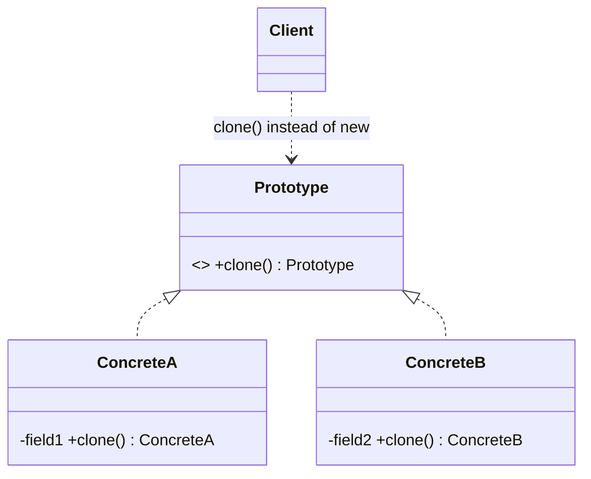
```mermaid
classDiagram
    class Prototype { <<interface>> +clone() Prototype }
    class ConcreteA { -field1 +clone() ConcreteA }
    class ConcreteB { -field2 +clone() ConcreteB }
    class Client
    Prototype <|.. ConcreteA
    Prototype <|.. ConcreteB
    Client ..> Prototype : clone() instead of new
```

#### ⚠️ Shallow vs Deep copy — *the* interview question here

```
   SHALLOW COPY                        DEEP COPY
   original ──┐                        original ──▶ [List A]
              ├──▶ [same List]         copy     ──▶ [List B]  (new list, new elements)
   copy    ───┘
   mutating via copy corrupts original  fully independent
```

#### Java

```java
public class Document implements Cloneable {
    private String title;
    private List<String> sections;              // MUTABLE reference — the danger zone
    private final Metadata metadata;            // also mutable

    public Document(String title, List<String> sections, Metadata metadata) {
        this.title = title; this.sections = sections; this.metadata = metadata;
    }

    // ---------- shallow: copies the reference, NOT the list ----------
    public Document shallowCopy() throws CloneNotSupportedException {
        return (Document) super.clone();        // Object.clone() is field-by-field = shallow
    }

    // ---------- deep: recursively copies mutable state ----------
    @Override
    public Document clone() {
        return new Document(this.title,
                            new ArrayList<>(this.sections),   // new list
                            this.metadata.clone());           // recursively cloned
    }

    public void addSection(String s) { sections.add(s); }
    @Override public String toString() { return title + " " + sections; }
}

// ---------- Preferred in modern Java: a copy CONSTRUCTOR (no Cloneable weirdness) ----------
public class Config {
    private final Map<String, String> props;
    public Config(Map<String, String> props) { this.props = new HashMap<>(props); }
    public Config(Config other) { this(other.props); }        // copy constructor
    public Config with(String k, String v) {                  // functional "clone + tweak"
        Config copy = new Config(this);
        copy.props.put(k, v);
        return copy;
    }
}
```

#### Prototype **registry** — the common real-world shape

```java
public class ShapeRegistry {
    private final Map<String, Shape> prototypes = new HashMap<>();

    public void register(String key, Shape prototype) { prototypes.put(key, prototype); }

    public Shape create(String key) {
        Shape proto = prototypes.get(key);
        if (proto == null) throw new IllegalArgumentException("no prototype: " + key);
        return proto.clone();                                  // hand out a fresh copy
    }
}
```

#### ✅ When to use
- Object creation is expensive (DB/network/heavy computation) and instances are mostly similar.
- You need copies but the concrete classes are decided at runtime.
- "Duplicate" / "Save as" / "Copy layer" features in editors and design tools.

#### ⚠️ Traps
- **`Cloneable` is a broken interface** (it has no `clone()` method; `Object.clone()` is `protected`). Bloch: *prefer a copy constructor or static factory.*
- Deep-cloning object graphs with cycles needs an identity map.
- Serialization-based deep copy is easy but slow and requires `Serializable`.

**JDK:** `Object.clone()`, `ArrayList.clone()`, `Cloneable`.

📁 *In this repo:* `src/com/java/demo/creational/prototype/`

---
---
<a id="structural"></a>

## 14. 🧱 Structural Patterns

---

### 14.1 Adapter

> **Intent:** Convert the interface of a class into another interface clients expect. Lets incompatible classes work together.

**Analogy:** a travel power plug. Your laptop (client) expects a flat pin; the wall (adaptee) has round holes; the adapter translates.

#### The problem
```
   ┌──────────┐  expects  ┌────────────────┐        ┌──────────────────────┐
   │  Client  │──────────▶│ «interface»    │   ✗    │ LegacyXmlService     │
   └──────────┘           │ JsonAnalytics  │◀ ─ ─ ─ │ (returns XML, wrong  │
                          │  +analyze(json)│        │  method names)       │
                          └───────▲────────┘        └──────────▲───────────┘
                                  │ implements                 │ wraps (has-a)
                          ┌───────┴──────────────────────────  ┘
                          │  XmlToJsonAdapter                 │
                          │  analyze(json) { xml = convert(); │
                          │      legacy.parseXml(xml); }      │
                          └───────────────────────────────────┘
```

#### Structure
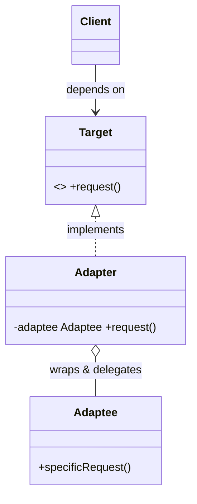
```mermaid
classDiagram
    class Target { <<interface>> +request() }
    class Client
    class Adaptee { +specificRequest() }
    class Adapter { -adaptee Adaptee +request() }

    Client --> Target : depends on
    Target <|.. Adapter : implements
    Adapter o-- Adaptee : wraps & delegates
```

#### Java

```java
// ---------- Target: what our code wants to talk to ----------
public interface PaymentProcessor {
    PaymentResult pay(String orderId, BigDecimal amount);
}

// ---------- Adaptee: a third-party SDK we cannot modify ----------
public class LegacyStripeSdk {
    public Map<String, Object> makeCharge(long amountInCents, String currency, String idempotencyKey) {
        System.out.println("Stripe charging " + amountInCents + " cents");
        return Map.of("status", "succeeded", "id", "ch_" + idempotencyKey);
    }
}

// ---------- Adapter: object adapter (composition) — PREFERRED ----------
public class StripeAdapter implements PaymentProcessor {
    private final LegacyStripeSdk sdk;                       // HAS-A the adaptee

    public StripeAdapter(LegacyStripeSdk sdk) { this.sdk = sdk; }

    @Override
    public PaymentResult pay(String orderId, BigDecimal amount) {
        long cents = amount.movePointRight(2).longValueExact();      // translate the data
        Map<String, Object> raw = sdk.makeCharge(cents, "USD", orderId);   // translate the call
        return "succeeded".equals(raw.get("status"))                       // translate the result
                ? PaymentResult.success((String) raw.get("id"))
                : PaymentResult.failure("stripe declined");
    }
}

// ---------- Client is blissfully unaware ----------
public class Checkout {
    private final PaymentProcessor processor;
    public Checkout(PaymentProcessor processor) { this.processor = processor; }
    public void confirm(Order o) { processor.pay(o.id(), o.total()); }
}

new Checkout(new StripeAdapter(new LegacyStripeSdk())).confirm(order);
```

**Class adapter** (inheritance-based) — possible only when the adaptee is a class you can extend, and Java's single inheritance limits it:
```java
public class StripeClassAdapter extends LegacyStripeSdk implements PaymentProcessor {
    @Override public PaymentResult pay(String orderId, BigDecimal amount) {
        return "succeeded".equals(makeCharge(amount.movePointRight(2).longValueExact(), "USD", orderId).get("status"))
                ? PaymentResult.success(orderId) : PaymentResult.failure("declined");
    }
}
```
✅ Prefer the **object adapter** — it can adapt subclasses too and doesn't inherit unwanted API.

#### ✅ When to use
- Integrating a third-party/legacy library whose interface doesn't match yours.
- Unifying several similar-but-different APIs behind one interface (`PaymentProcessor` over Stripe/Razorpay/PayPal).
- Wrapping a class you can't change (final, vendor-owned, generated).

#### ⚠️ Traps
- Adapter **translates**; it must not add new business logic (that's Decorator's job).
- Too many adapter layers → debug hell. Sometimes changing the client is cheaper.

**JDK:** `Arrays.asList()`, `Collections.list(Enumeration)`, `InputStreamReader` (bytes→chars), `java.io.OutputStreamWriter`.

---

### 14.2 Bridge

> **Intent:** Decouple an **abstraction** from its **implementation** so the two can vary independently.

**Use it when you have two independent dimensions and a class explosion.**

#### The problem
```
❌ INHERITANCE EXPLOSION — shapes × renderers = N×M classes
                    Shape
      ┌───────────────┼───────────────┐
   Circle          Square          Triangle
   ┌──┴──┐         ┌──┴──┐         ┌──┴──┐
 VecCircle RasCircle VecSq RasSq  VecTri RasTri     ← add "SVG" renderer = 3 MORE classes
                                                      add "Hexagon" = 2 more. 💥

✅ BRIDGE — split into two hierarchies joined by composition: N + M classes
   ABSTRACTION                        IMPLEMENTATION
   ┌────────────┐    has-a    ┌──────────────────┐
   │   Shape    │────────────▶│ «interface»      │
   └──────▲─────┘   (bridge)  │   Renderer       │
     ┌────┴────┐              └────────▲─────────┘
  Circle   Square         ┌────────────┼────────────┐
                       Vector       Raster        SVG
   add a shape → 1 class.  add a renderer → 1 class.
```

#### Structure
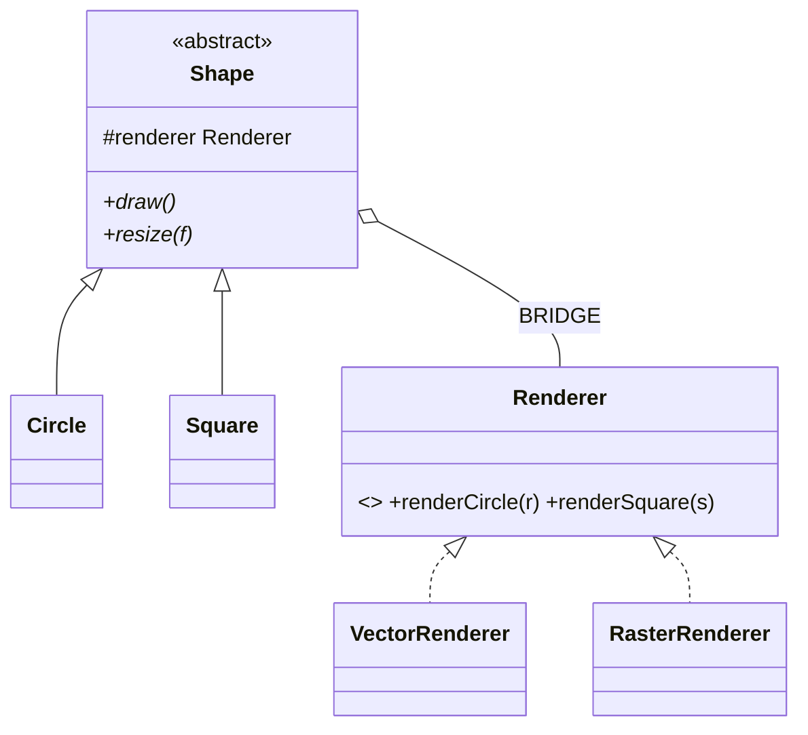
```mermaid
classDiagram
    class Shape {
        <<abstract>>
        #renderer Renderer
        +draw()*
        +resize(f)*
    }
    class Circle
    class Square
    class Renderer { <<interface>> +renderCircle(r) +renderSquare(s) }
    class VectorRenderer
    class RasterRenderer

    Shape <|-- Circle
    Shape <|-- Square
    Shape o-- Renderer : BRIDGE
    Renderer <|.. VectorRenderer
    Renderer <|.. RasterRenderer
```

#### Java

```java
// ---------- Implementation hierarchy ("how to draw") ----------
public interface Renderer {
    void renderCircle(double radius);
    void renderSquare(double side);
}

public class VectorRenderer implements Renderer {
    public void renderCircle(double r) { System.out.println("Drawing circle of radius " + r + " as vectors"); }
    public void renderSquare(double s) { System.out.println("Drawing square of side "   + s + " as vectors"); }
}
public class RasterRenderer implements Renderer {
    public void renderCircle(double r) { System.out.println("Rasterizing circle of radius " + r + " as pixels"); }
    public void renderSquare(double s) { System.out.println("Rasterizing square of side "   + s + " as pixels"); }
}

// ---------- Abstraction hierarchy ("what to draw") ----------
public abstract class Shape {
    protected final Renderer renderer;              // ← THE BRIDGE
    protected Shape(Renderer renderer) { this.renderer = renderer; }
    public abstract void draw();
    public abstract void resize(double factor);
}

public class Circle extends Shape {
    private double radius;
    public Circle(Renderer r, double radius) { super(r); this.radius = radius; }
    public void draw() { renderer.renderCircle(radius); }
    public void resize(double f) { radius *= f; }
}

public class Square extends Shape {
    private double side;
    public Square(Renderer r, double side) { super(r); this.side = side; }
    public void draw() { renderer.renderSquare(side); }
    public void resize(double f) { side *= f; }
}

// ---------- Client: mix and match freely ----------
new Circle(new VectorRenderer(), 5).draw();
new Circle(new RasterRenderer(), 5).draw();
new Square(new VectorRenderer(), 3).draw();
```

**Real-world shape you'll actually build:**
```java
// Abstraction: WHAT kind of message   |   Implementation: HOW it's delivered
abstract class Message { protected final Sender sender; ... }
class TextMessage extends Message {} ; class UrgentMessage extends Message {}
interface Sender { void send(String body); }
class EmailSender implements Sender {} ; class SmsSender implements Sender {} ; class SlackSender implements Sender {}
```

#### ✅ When to use
- Two (or more) orthogonal dimensions of variation → `N×M` subclass explosion.
- You want to switch the implementation at **runtime**.
- Platform-independent code: `Shape`/`Renderer`, `Message`/`Sender`, `Remote`/`Device`, JDBC `Driver`/`Connection`.

#### ⚠️ Bridge vs Adapter (asked constantly)
| | Bridge | Adapter |
|---|---|---|
| **When decided** | Up front, by design | After the fact, to fix a mismatch |
| **Goal** | Prevent class explosion; let both sides evolve | Make an existing incompatible class usable |
| **Both sides** | Designed together | Adaptee is out of your control |

**JDK:** JDBC (`Driver` ↔ `Connection`), SLF4J (API bridged to Logback/Log4j), AWT peers.

---

### 14.3 Composite

> **Intent:** Compose objects into **tree structures**, then let clients treat individual objects and compositions **uniformly**.

**Analogy:** a file system. A folder and a file both answer "what's your size?" — you don't care which one you're holding.

#### The problem
```
   ❌ Client has to branch:  if (node instanceof Folder) { recurse } else { leaf }

   ✅ Both implement the same interface:
                        ┌──────────────────┐
                        │ «FileComponent»  │  size(), print()
                        └────────▲─────────┘
                     ┌───────────┴────────────┐
              ┌──────┴──────┐          ┌──────┴────────┐
              │  File(leaf) │          │ Folder(comp.) │──┐ children: List<FileComponent>
              └─────────────┘          └───────────────┘◀─┘   (recursion!)

   /project              Folder ─┬─ pom.xml            File  2 KB
        │                        ├─ /src               Folder ─┬─ Main.java   4 KB
        │                        │                             └─ Util.java   1 KB
        └─ total = 7 KB          └─ README.md          File  0 KB
```

#### Structure
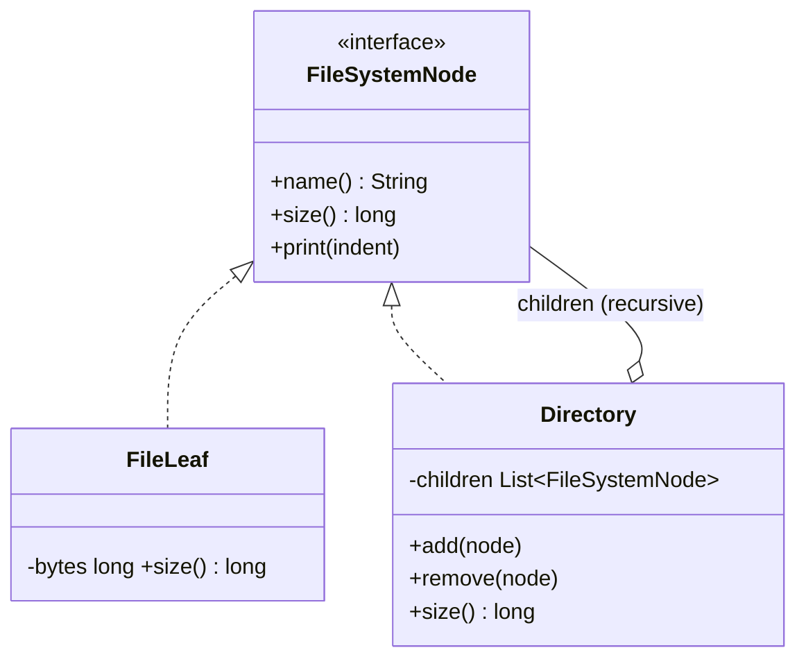
```mermaid
classDiagram
    class FileSystemNode {
        <<interface>>
        +name() String
        +size() long
        +print(indent)
    }
    class FileLeaf { -bytes long +size() long }
    class Directory {
        -children List~FileSystemNode~
        +add(node)
        +remove(node)
        +size() long
    }
    FileSystemNode <|.. FileLeaf
    FileSystemNode <|.. Directory
    Directory o-- FileSystemNode : children (recursive)
```

#### Java

```java
// ---------- Component ----------
public interface FileSystemNode {
    String name();
    long size();
    default void print(String indent) { System.out.println(indent + name() + " (" + size() + " B)"); }
}

// ---------- Leaf ----------
public class FileLeaf implements FileSystemNode {
    private final String name;
    private final long bytes;
    public FileLeaf(String name, long bytes) { this.name = name; this.bytes = bytes; }
    public String name() { return name; }
    public long size()   { return bytes; }
}

// ---------- Composite ----------
public class Directory implements FileSystemNode {
    private final String name;
    private final List<FileSystemNode> children = new ArrayList<>();

    public Directory(String name) { this.name = name; }

    public Directory add(FileSystemNode node) { children.add(node); return this; }
    public void remove(FileSystemNode node)   { children.remove(node); }

    public String name() { return name + "/"; }

    @Override
    public long size() {                                  // recursion — the heart of Composite
        return children.stream().mapToLong(FileSystemNode::size).sum();
    }

    @Override
    public void print(String indent) {
        System.out.println(indent + name() + " (" + size() + " B)");
        children.forEach(c -> c.print(indent + "    "));  // uniform call on leaf OR composite
    }
}

// ---------- Client treats everything the same ----------
FileSystemNode project = new Directory("project")
        .add(new FileLeaf("pom.xml", 2048))
        .add(new Directory("src")
                .add(new FileLeaf("Main.java", 4096))
                .add(new FileLeaf("Util.java", 1024)))
        .add(new FileLeaf("README.md", 512));

project.print("");
System.out.println("Total: " + project.size());   // no instanceof anywhere
```

#### Design decision: **safety vs transparency**
| Approach | `add()/remove()` live in | Pro | Con |
|---|---|---|---|
| **Transparent** (GoF default) | the Component interface | client never needs `instanceof` | leaves must throw/no-op on `add()` — LSP smell |
| **Safe** (shown above) | only in Composite | type-safe, no fake methods | client must know it's a composite to add children |

#### ✅ When to use
- Part-whole hierarchies: file systems, org charts, UI widget trees, XML/DOM, menus & submenus, nested comments, order + bundled sub-items.
- Whenever you catch yourself writing `if (isLeaf) … else recurse …`.

#### ⚠️ Traps
- Hard to constrain types ("a `Playlist` may only contain `Song`s") — the interface is deliberately generic.
- Deep trees + expensive `size()` → cache and invalidate on mutation.

**JDK:** `java.awt.Container`/`Component`, Swing `JPanel`, `javax.faces.component.UIComponent`.

---

### 14.4 Decorator

> **Intent:** Attach **additional responsibilities to an object dynamically**, by wrapping it. A flexible alternative to subclassing.

#### The problem
```
❌ Subclass explosion for every combination
   CoffeeWithMilk, CoffeeWithSugar, CoffeeWithMilkAndSugar,
   CoffeeWithMilkAndSugarAndWhip, ...  (2^n classes) 💥

✅ Wrap at runtime — stack the behaviours like matryoshka dolls
   ┌──────────────────────────────────────────────┐
   │ WhipDecorator                                │  cost = 0.7 + inner
   │  ┌────────────────────────────────────────┐  │
   │  │ MilkDecorator                          │  │  cost = 0.5 + inner
   │  │   ┌──────────────────────────────────┐ │  │
   │  │   │ SimpleCoffee (the real object)   │ │  │  cost = 2.0
   │  │   └──────────────────────────────────┘ │  │
   │  └────────────────────────────────────────┘  │
   └──────────────────────────────────────────────┘   total = 3.2
    Each layer implements the SAME interface → any layer can be swapped/reordered.
```

#### Structure
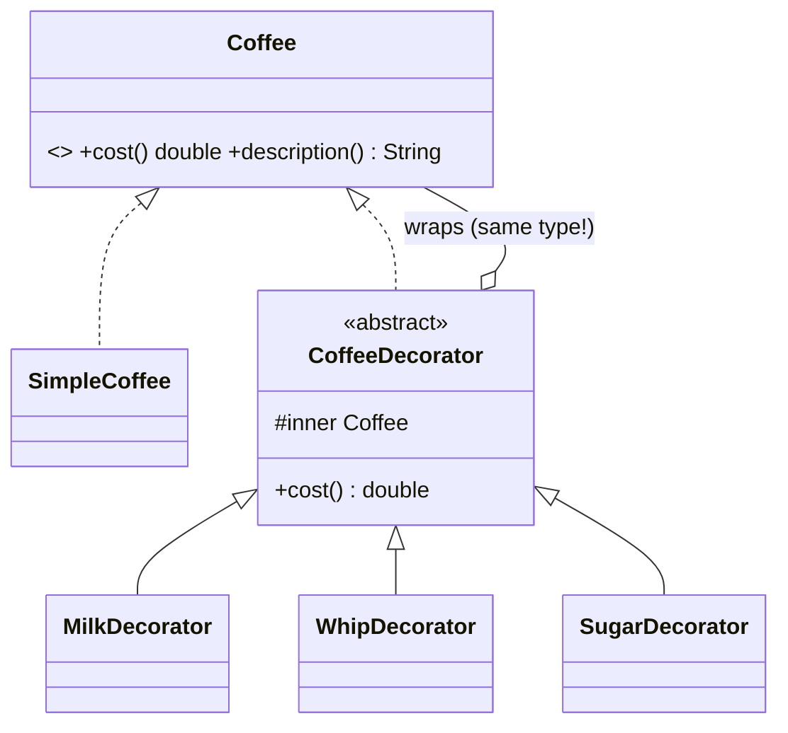
```mermaid
classDiagram
    class Coffee { <<interface>> +cost() double +description() String }
    class SimpleCoffee
    class CoffeeDecorator {
        <<abstract>>
        #inner Coffee
        +cost() double
    }
    class MilkDecorator
    class WhipDecorator
    class SugarDecorator

    Coffee <|.. SimpleCoffee
    Coffee <|.. CoffeeDecorator
    CoffeeDecorator o-- Coffee : wraps (same type!)
    CoffeeDecorator <|-- MilkDecorator
    CoffeeDecorator <|-- WhipDecorator
    CoffeeDecorator <|-- SugarDecorator
```

#### Java

```java
// ---------- Component ----------
public interface Coffee {
    double cost();
    String description();
}

// ---------- Concrete component ----------
public class SimpleCoffee implements Coffee {
    public double cost() { return 2.00; }
    public String description() { return "Coffee"; }
}

// ---------- Base decorator: implements the interface AND holds one ----------
public abstract class CoffeeDecorator implements Coffee {
    protected final Coffee inner;                         // the wrapped object
    protected CoffeeDecorator(Coffee inner) { this.inner = inner; }
    public double cost() { return inner.cost(); }         // default: pure delegation
    public String description() { return inner.description(); }
}

// ---------- Concrete decorators: delegate, then add ----------
public class MilkDecorator extends CoffeeDecorator {
    public MilkDecorator(Coffee inner) { super(inner); }
    @Override public double cost() { return super.cost() + 0.50; }
    @Override public String description() { return super.description() + " + milk"; }
}
public class WhipDecorator extends CoffeeDecorator {
    public WhipDecorator(Coffee inner) { super(inner); }
    @Override public double cost() { return super.cost() + 0.70; }
    @Override public String description() { return super.description() + " + whip"; }
}
public class SugarDecorator extends CoffeeDecorator {
    private final int spoons;
    public SugarDecorator(Coffee inner, int spoons) { super(inner); this.spoons = spoons; }
    @Override public double cost() { return super.cost() + 0.10 * spoons; }
    @Override public String description() { return super.description() + " + " + spoons + " sugar"; }
}

// ---------- Client composes at runtime ----------
Coffee order = new WhipDecorator(new MilkDecorator(new SugarDecorator(new SimpleCoffee(), 2)));
System.out.println(order.description() + " = $" + order.cost());
// Coffee + 2 sugar + milk + whip = $3.40
```

**The pattern you'll actually meet in production:**
```java
// I/O streams are the canonical Decorator chain
InputStream in = new GZIPInputStream(
                     new BufferedInputStream(
                         new FileInputStream("data.gz")));   // each layer adds one capability

// HTTP middleware / filters
Handler h = new AuthDecorator(new RateLimitDecorator(new LoggingDecorator(new ApiHandler())));
```

#### ✅ When to use
- Add/remove responsibilities **at runtime**, in any combination or order.
- Extending by subclassing is impossible (`final` class) or would explode combinatorially.
- Cross-cutting concerns: logging, caching, compression, encryption, retries, metrics, auth.

#### ⚠️ Traps
- Long wrapper chains are hard to debug — stack traces get deep.
- Decorators must be **order-independent** where possible; encrypt-then-compress ≠ compress-then-encrypt.
- Identity breaks: `decorated != original`, so `equals`/`==` checks on the wrapped object fail.

**JDK:** `java.io.*` streams, `Collections.unmodifiableList/synchronizedList`, `javax.servlet.http.HttpServletRequestWrapper`.

---

### 14.5 Facade

> **Intent:** Provide a **simple, unified interface** to a complex subsystem.

**Analogy:** a restaurant waiter. You say "one pasta" — you don't talk to the chef, the store room, and the dishwasher yourself.

#### The problem
```
❌ Client must know & orchestrate 6 subsystem classes, in the right order
   ┌────────┐ ──▶ VideoFile ──▶ CodecFactory ──▶ BitrateReader
   │ Client │ ──▶ AudioMixer ──▶ MPEG4Codec   ──▶ FileWriter
   └────────┘   (and if the order changes, every client breaks)

✅ One door
   ┌────────┐        ┌──────────────────────┐        ┌──────── subsystem ────────┐
   │ Client │───────▶│ VideoConverter       │───────▶│ VideoFile, CodecFactory,  │
   └────────┘ convert│  (FACADE)            │        │ BitrateReader, AudioMixer │
                     └──────────────────────┘        └───────────────────────────┘
   Facade does NOT hide the subsystem — advanced clients can still use it directly.
```

#### Structure
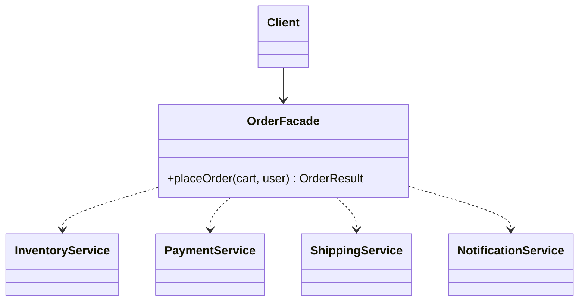
```mermaid
classDiagram
    class Client
    class OrderFacade {
        +placeOrder(cart, user) OrderResult
    }
    class InventoryService
    class PaymentService
    class ShippingService
    class NotificationService

    Client --> OrderFacade
    OrderFacade ..> InventoryService
    OrderFacade ..> PaymentService
    OrderFacade ..> ShippingService
    OrderFacade ..> NotificationService
```

#### Java

```java
// ---------- Complex subsystem (each class is fine on its own) ----------
class InventoryService    { boolean reserve(Cart c) { ...; return true; } void release(Cart c) { ... } }
class PaymentService      { String charge(User u, Money amt) { ...; return "txn_123"; } void refund(String txn) { ... } }
class ShippingService     { String schedule(Cart c, Address a) { ...; return "SHIP-9"; } }
class NotificationService { void orderConfirmed(User u, String shipmentId) { ... } }

// ---------- Facade: one method, correct order, error handling ----------
public class OrderFacade {
    private final InventoryService inventory;
    private final PaymentService payments;
    private final ShippingService shipping;
    private final NotificationService notifications;

    public OrderFacade(InventoryService i, PaymentService p, ShippingService s, NotificationService n) {
        this.inventory = i; this.payments = p; this.shipping = s; this.notifications = n;
    }

    public OrderResult placeOrder(User user, Cart cart, Address address) {
        if (!inventory.reserve(cart)) return OrderResult.outOfStock();

        String txnId = null;
        try {
            txnId = payments.charge(user, cart.total());
            String shipmentId = shipping.schedule(cart, address);
            notifications.orderConfirmed(user, shipmentId);
            return OrderResult.success(shipmentId, txnId);
        } catch (RuntimeException e) {
            if (txnId != null) payments.refund(txnId);      // compensating actions,
            inventory.release(cart);                        // hidden from the client
            return OrderResult.failed(e.getMessage());
        }
    }
}

// ---------- Client: one line ----------
OrderResult result = orderFacade.placeOrder(user, cart, address);
```

#### ✅ When to use
- A subsystem is complex, or clients only need 20% of its power.
- You want to **decouple** your code from a library (the facade is the only place that knows it — swapping the library touches one class).
- Layering: give each layer a facade so layers talk only to facades.

#### ⚠️ Traps
- A facade can grow into a **god object**. Split it by use case (`OrderFacade`, `RefundFacade`) when it does.
- Don't make the facade the *only* way in — leave the subsystem accessible for power users.
- A facade that just forwards one call to one class adds nothing.

**Facade vs Adapter:** Facade **simplifies** an interface you own or chose; Adapter **converts** an interface to one that already exists and can't change.

**JDK/Spring:** `javax.faces.context.FacesContext`, SLF4J's `LoggerFactory`, Spring's `JdbcTemplate` (facade over raw JDBC), `java.net.URL.openStream()`.

---

### 14.6 Flyweight

> **Intent:** Use **sharing** to support large numbers of fine-grained objects efficiently.

#### The key idea: split state
```
   INTRINSIC state  = shared, immutable, context-free   → stored ONCE in the flyweight
   EXTRINSIC state  = unique per use, context-dependent → passed in as method args

   Forest with 1,000,000 trees:
   ❌ each Tree object stores: x, y, name, color, texture(2 MB sprite)  →  ~2 TB 💥
   ✅ 3 TreeType flyweights hold {name, color, texture};
      each Tree holds only {x, y, TreeType ref}          →  ~24 MB ✅

   ┌───────────────────────────────────────────────────┐
   │ TreeTypeFactory (cache)                           │
   │   "Oak/green"   ──▶ [TreeType: sprite 2MB]  ◀──┐  │
   │   "Pine/dark"   ──▶ [TreeType: sprite 2MB]  ◀┐ │  │
   └───────────────────────────────────────────────┼─┼──┘
     Tree(1,2)──────────────────────────────────────┼─┘  shares
     Tree(9,4)──────────────────────────────────────┘    shares
     ... 1,000,000 lightweight objects
```

#### Structure
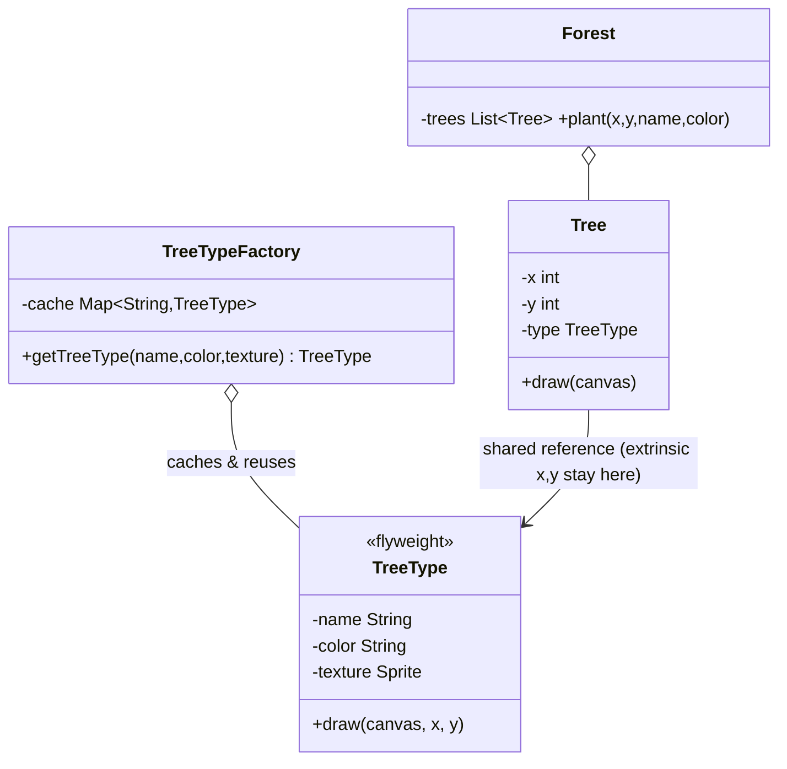
```mermaid
classDiagram
    class TreeType {
        <<flyweight>>
        -name String
        -color String
        -texture Sprite
        +draw(canvas, x, y)
    }
    class TreeTypeFactory {
        -cache Map~String,TreeType~
        +getTreeType(name,color,texture) TreeType
    }
    class Tree {
        -x int
        -y int
        -type TreeType
        +draw(canvas)
    }
    class Forest { -trees List~Tree~ +plant(x,y,name,color) }

    TreeTypeFactory o-- TreeType : caches & reuses
    Tree --> TreeType : shared reference (extrinsic x,y stay here)
    Forest o-- Tree
```

#### Java

```java
// ---------- Flyweight: INTRINSIC state only, and it MUST be immutable ----------
public final class TreeType {
    private final String name;
    private final String color;
    private final byte[] texture;          // the expensive part

    TreeType(String name, String color, byte[] texture) {
        this.name = name; this.color = color; this.texture = texture;
    }

    public void draw(Canvas canvas, int x, int y) {        // extrinsic state comes in as ARGS
        canvas.drawSprite(texture, x, y, color);
    }
}

// ---------- Flyweight factory: guarantees sharing ----------
public class TreeTypeFactory {
    private static final Map<String, TreeType> CACHE = new ConcurrentHashMap<>();

    public static TreeType get(String name, String color, byte[] texture) {
        return CACHE.computeIfAbsent(name + "|" + color, k -> {
            System.out.println("creating new TreeType: " + k);   // prints ONCE per unique type
            return new TreeType(name, color, texture);
        });
    }
    public static int distinctTypes() { return CACHE.size(); }
}

// ---------- Context object: tiny, holds extrinsic state + a shared reference ----------
public class Tree {
    private final int x, y;                 // extrinsic (unique)
    private final TreeType type;            // shared pointer, not a copy

    public Tree(int x, int y, TreeType type) { this.x = x; this.y = y; this.type = type; }
    public void draw(Canvas c) { type.draw(c, x, y); }
}

// ---------- Client ----------
public class Forest {
    private final List<Tree> trees = new ArrayList<>();

    public void plant(int x, int y, String name, String color, byte[] texture) {
        trees.add(new Tree(x, y, TreeTypeFactory.get(name, color, texture)));
    }
    public void draw(Canvas c) { trees.forEach(t -> t.draw(c)); }
}

Forest forest = new Forest();
for (int i = 0; i < 1_000_000; i++)
    forest.plant(rnd(), rnd(), i % 2 == 0 ? "Oak" : "Pine", "green", SPRITE);
System.out.println(TreeTypeFactory.distinctTypes());   // 2  ← a million trees, two textures
```

#### ✅ When to use
- Millions of objects and memory is the bottleneck (game entities, text editor glyphs, map markers, particles).
- Most of each object's state is **duplicated** and can be made immutable.
- **Measure first.** If memory isn't a problem, flyweight is complexity for nothing.

#### ⚠️ Traps
- Flyweights **must be immutable** — they're shared across the whole app; mutating one corrupts everyone.
- CPU/memory trade-off: you may recompute extrinsic state on every call.
- The cache itself can leak — bound it, or use `WeakHashMap`.

**JDK:** `Integer.valueOf()` (caches −128..127), `String` literal pool, `Boolean.valueOf()`, `Character.valueOf()`.
```java
Integer a = 127, b = 127;   System.out.println(a == b);   // true  ← same flyweight!
Integer c = 128, d = 128;   System.out.println(c == d);   // false ← outside the cache
```

---

### 14.7 Proxy

> **Intent:** Provide a **surrogate or placeholder** for another object to **control access** to it.

Proxy implements the **same interface** as the real object, so the client can't tell the difference.

#### The problem
```
   ┌────────┐        ┌───────────────┐  same interface   ┌────────────────┐
   │ Client │───────▶│  ImageProxy   │──────────────────▶│  RealImage     │
   └────────┘        │ • lazy load   │   (created only   │ • loads 20 MB  │
                     │ • cache       │    when needed)   │   from disk    │
                     │ • check perms │                   └────────────────┘
                     │ • log/meter   │
                     └───────────────┘
```

#### The five kinds of proxy
| Type | Purpose | Example |
|---|---|---|
| **Virtual** | Delay creating an expensive object until first use | lazy-loaded image, Hibernate lazy entity |
| **Protection** | Check permissions before delegating | `@PreAuthorize` on a service |
| **Remote** | Local stand-in for an object on another machine | RMI stub, gRPC/Feign client |
| **Caching** | Return cached results instead of calling through | `@Cacheable` |
| **Smart reference** | Extra bookkeeping: ref counts, locking, logging | `@Transactional`, metrics |

#### Structure
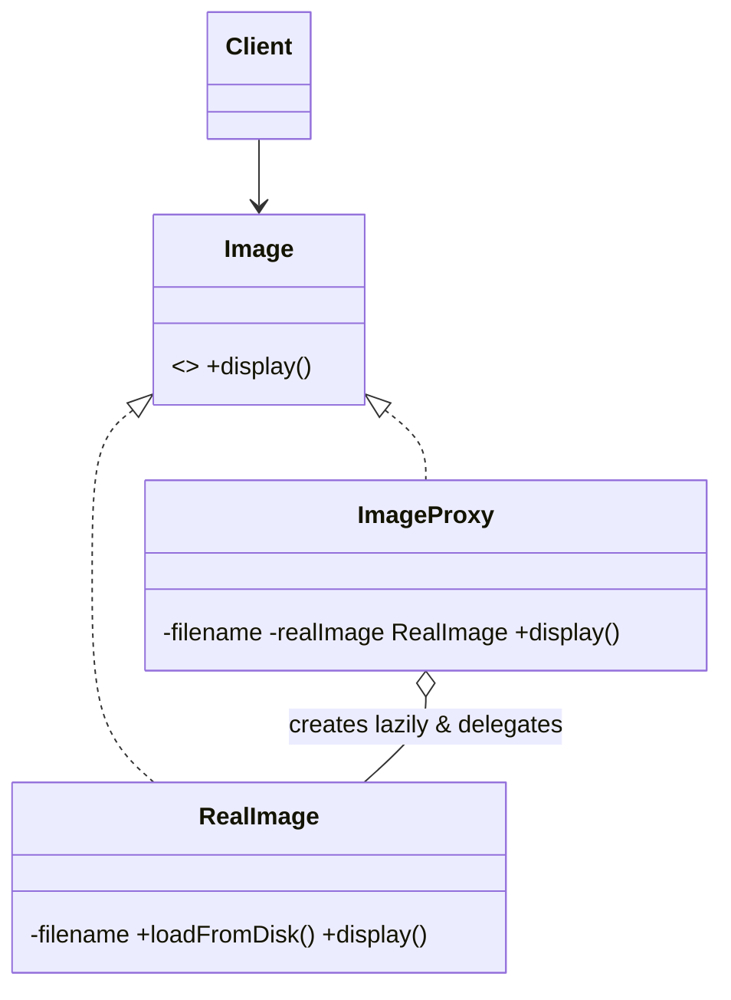
```mermaid
classDiagram
    class Image { <<interface>> +display() }
    class RealImage { -filename +loadFromDisk() +display() }
    class ImageProxy { -filename -realImage RealImage +display() }
    class Client

    Image <|.. RealImage
    Image <|.. ImageProxy
    ImageProxy o-- RealImage : creates lazily & delegates
    Client --> Image
```

#### Java

```java
// ---------- Subject ----------
public interface Image {
    void display();
}

// ---------- Real subject: expensive ----------
public class RealImage implements Image {
    private final String filename;
    public RealImage(String filename) {
        this.filename = filename;
        loadFromDisk();                                  // 💰 happens in the constructor
    }
    private void loadFromDisk() { System.out.println("Loading 20MB " + filename + " from disk..."); }
    public void display() { System.out.println("Displaying " + filename); }
}

// ---------- Virtual proxy: same interface, defers the cost ----------
public class ImageProxy implements Image {
    private final String filename;
    private RealImage realImage;                          // null until actually needed

    public ImageProxy(String filename) { this.filename = filename; }   // cheap!

    @Override
    public void display() {
        if (realImage == null) realImage = new RealImage(filename);    // lazy init
        realImage.display();
    }
}

// ---------- Protection proxy ----------
public class SecureDocumentProxy implements Document {
    private final Document real;
    private final User user;
    public SecureDocumentProxy(Document real, User user) { this.real = real; this.user = user; }

    @Override public String read() {
        if (!user.hasRole(Role.READER)) throw new AccessDeniedException("read denied for " + user);
        return real.read();
    }
    @Override public void write(String content) {
        if (!user.hasRole(Role.EDITOR)) throw new AccessDeniedException("write denied for " + user);
        real.write(content);
    }
}

// ---------- Caching proxy ----------
public class CachingPriceService implements PriceService {
    private final PriceService real;
    private final Map<String, Money> cache = new ConcurrentHashMap<>();
    public CachingPriceService(PriceService real) { this.real = real; }
    @Override public Money priceOf(String sku) { return cache.computeIfAbsent(sku, real::priceOf); }
}

// ---------- Client sees no difference ----------
List<Image> gallery = List.of(new ImageProxy("a.png"), new ImageProxy("b.png"));  // nothing loaded yet
gallery.get(0).display();     // ONLY a.png loads
```

**Dynamic proxies** — how Spring AOP, Mockito and Hibernate actually do it:
```java
PriceService proxied = (PriceService) Proxy.newProxyInstance(
        PriceService.class.getClassLoader(),
        new Class<?>[]{ PriceService.class },
        (proxy, method, args) -> {
            long t0 = System.nanoTime();
            Object result = method.invoke(realTarget, args);       // delegate
            System.out.println(method.getName() + " took " + (System.nanoTime() - t0) + "ns");
            return result;
        });
```

#### ✅ When to use
Lazy loading · access control · caching · logging/metrics · remote calls · transaction boundaries · rate limiting.

#### ⚠️ Traps
- Adds an indirection layer — response latency and stack depth.
- Lazy loading + a closed session = Hibernate's `LazyInitializationException`.
- **Proxy vs Decorator:** structurally identical (both wrap the same interface). The difference is **intent**: Proxy *controls access* to a specific object and usually manages its lifecycle; Decorator *adds behaviour* and is designed to stack.

**JDK/Spring:** `java.lang.reflect.Proxy`, RMI, `@Transactional`, `@Cacheable`, `@Async`, Hibernate lazy proxies, Mockito mocks.

---
---
<a id="behavioural"></a>

## 15. 🔁 Behavioural Patterns

---

### 15.1 Chain of Responsibility

> **Intent:** Pass a request along a **chain of handlers**. Each handler decides to process it, or pass it on.

**Analogy:** an expense approval flow. Team Lead → Manager → Director → CFO. Each approves up to a limit, otherwise escalates.

#### The problem
```
❌ One giant if/else that knows every rule
   if (amount <= 1000) leadApproves();
   else if (amount <= 10000) managerApproves();
   else if (amount <= 100000) directorApproves();
   else cfoApproves();                              ← every new tier edits this method

✅ A chain of independent handlers
   request ──▶ ┌──────────┐  can't handle  ┌──────────┐  can't  ┌──────────┐
               │ TeamLead │───────────────▶│ Manager  │────────▶│   CFO    │──▶ (unhandled)
               │ ≤ 1,000  │                │ ≤ 10,000 │         │    ∞     │
               └────┬─────┘                └────┬─────┘         └────┬─────┘
                 handles                     handles              handles
   Reorder, insert, or remove links without touching any other handler.
```

#### Structure
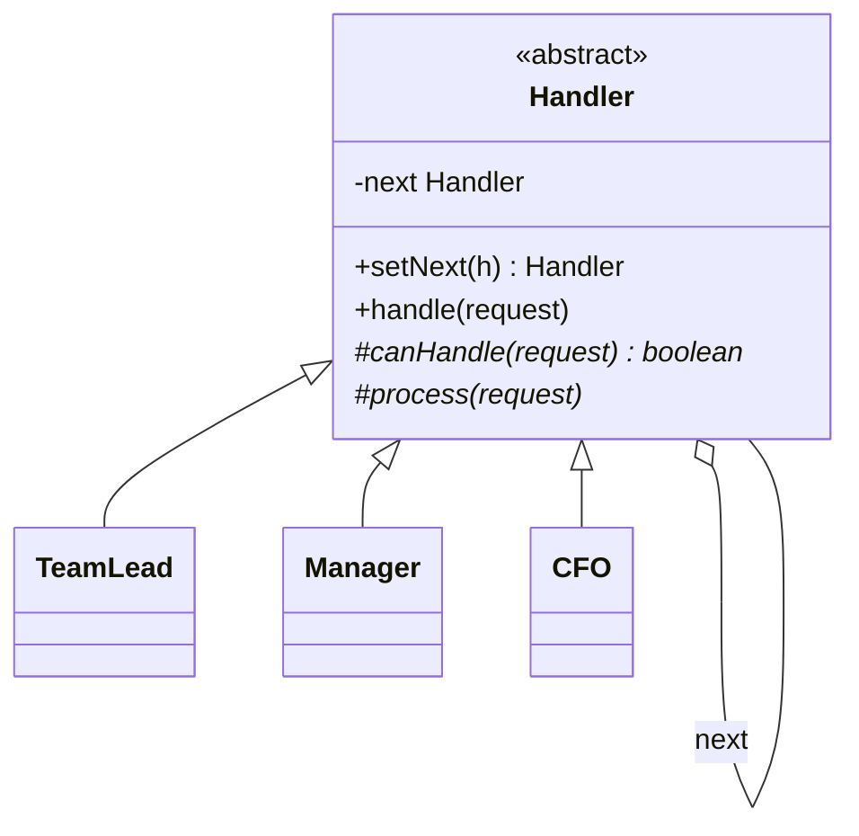
```mermaid
classDiagram
    class Handler {
        <<abstract>>
        -next Handler
        +setNext(h) Handler
        +handle(request)
        #canHandle(request)* boolean
        #process(request)*
    }
    class TeamLead
    class Manager
    class CFO
    Handler <|-- TeamLead
    Handler <|-- Manager
    Handler <|-- CFO
    Handler o-- Handler : next
```

#### Java

```java
public record ExpenseRequest(String employee, BigDecimal amount, String purpose) {}

// ---------- Handler base: owns the chaining logic once ----------
public abstract class Approver {
    private Approver next;

    public Approver setNext(Approver next) { this.next = next; return next; }   // fluent chaining

    public final void handle(ExpenseRequest request) {          // final: the algorithm is fixed
        if (canApprove(request)) {
            approve(request);
        } else if (next != null) {
            next.handle(request);                               // ← pass it along
        } else {
            System.out.println("❌ No one can approve " + request.amount());
        }
    }

    protected abstract boolean canApprove(ExpenseRequest r);
    protected abstract void approve(ExpenseRequest r);
}

// ---------- Concrete handlers ----------
public class TeamLead extends Approver {
    protected boolean canApprove(ExpenseRequest r) { return r.amount().compareTo(new BigDecimal("1000")) <= 0; }
    protected void approve(ExpenseRequest r) { System.out.println("✅ TeamLead approved " + r.amount()); }
}
public class Manager extends Approver {
    protected boolean canApprove(ExpenseRequest r) { return r.amount().compareTo(new BigDecimal("10000")) <= 0; }
    protected void approve(ExpenseRequest r) { System.out.println("✅ Manager approved " + r.amount()); }
}
public class CFO extends Approver {
    protected boolean canApprove(ExpenseRequest r) { return true; }
    protected void approve(ExpenseRequest r) { System.out.println("✅ CFO approved " + r.amount()); }
}

// ---------- Build the chain ----------
Approver lead = new TeamLead();
lead.setNext(new Manager()).setNext(new CFO());

lead.handle(new ExpenseRequest("ada", new BigDecimal("500"),   "books"));   // TeamLead
lead.handle(new ExpenseRequest("ada", new BigDecimal("7500"),  "laptop"));  // Manager
lead.handle(new ExpenseRequest("ada", new BigDecimal("250000"),"server"));  // CFO
```

**The "every handler runs" variant** — this is HTTP middleware / servlet filters:
```java
public interface Middleware {
    Response handle(Request req, Chain chain);          // chain.proceed() continues
}
class AuthMiddleware implements Middleware {
    public Response handle(Request req, Chain chain) {
        if (!req.hasValidToken()) return Response.unauthorized();   // short-circuit
        return chain.proceed(req);                                  // or continue
    }
}
class LoggingMiddleware implements Middleware {
    public Response handle(Request req, Chain chain) {
        long t0 = System.currentTimeMillis();
        Response res = chain.proceed(req);                          // runs the rest,
        System.out.println(req.path() + " -> " + res.status() + " in " + (System.currentTimeMillis()-t0) + "ms");
        return res;                                                 // then does work on the way back
    }
}
```

#### ✅ When to use
- Multiple objects may handle a request and the handler isn't known up front.
- You want to configure the handler set/order at runtime.
- Approval workflows, request filters/middleware, event bubbling in UIs, logging levels, exception handlers, validation pipelines.

#### ⚠️ Traps
- A request can fall off the end **unhandled** — decide explicitly (throw, default handler, or ignore).
- Debugging long chains is hard; log which handler consumed the request.
- Don't build a chain when a simple `Map<Type, Handler>` lookup would do.

**JDK/Spring:** `javax.servlet.Filter` / `FilterChain`, Spring Security's filter chain, `java.util.logging.Logger` parent handlers, OkHttp `Interceptor`, Netty `ChannelPipeline`.

📁 *In this repo:* `src/com/java/demo/behavioural/chainOfResponsibility/`

---

### 15.2 Command

> **Intent:** Encapsulate a **request as an object**, letting you parameterize clients, queue or log requests, and support **undo**.

#### The problem
```
❌ A button hard-codes what it does → one Button subclass per action

✅ Turn "do X" into an object with execute()/undo()
   ┌────────┐  sets   ┌───────────┐  execute()  ┌───────────┐  acts on  ┌──────────┐
   │ Client │────────▶│  Invoker  │────────────▶│  Command  │──────────▶│ Receiver │
   │ (wires)│         │ (Button,  │             │ (concrete)│           │ (Light,  │
   └────────┘         │  Menu,    │             │  +undo()  │           │  Editor) │
                      │  Queue)   │             └───────────┘           └──────────┘
                      └───────────┘
   Because the request is an object, you can: put it in a list (macro), a queue
   (job scheduler), a stack (undo/redo), or on disk (transaction log).
```

#### Structure
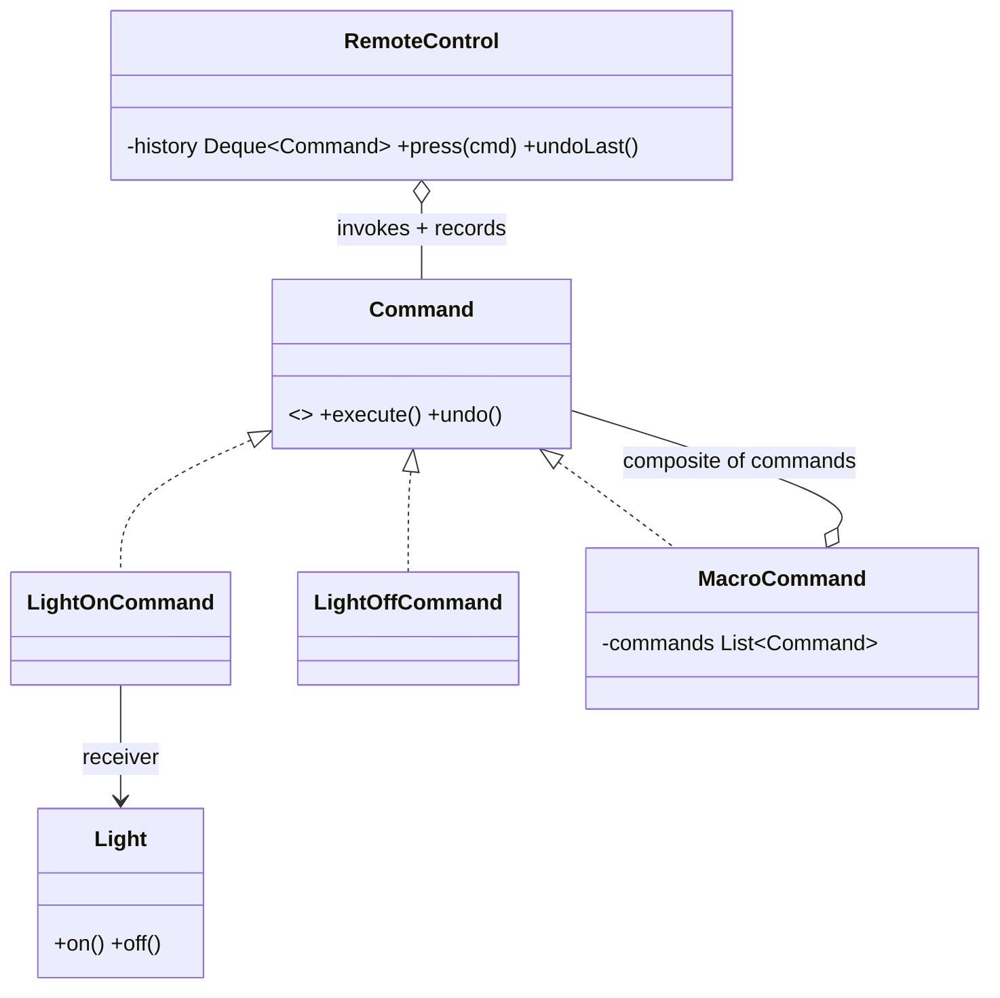
```mermaid
classDiagram
    class Command { <<interface>> +execute() +undo() }
    class LightOnCommand
    class LightOffCommand
    class MacroCommand { -commands List~Command~ }
    class RemoteControl { -history Deque~Command~ +press(cmd) +undoLast() }
    class Light { +on() +off() }

    Command <|.. LightOnCommand
    Command <|.. LightOffCommand
    Command <|.. MacroCommand
    RemoteControl o-- Command : invokes + records
    LightOnCommand --> Light : receiver
    MacroCommand o-- Command : composite of commands
```

#### Java

```java
// ---------- Command ----------
public interface Command {
    void execute();
    void undo();
}

// ---------- Receiver: does the real work, knows nothing about commands ----------
public class Light {
    private final String room;
    private boolean on;
    public Light(String room) { this.room = room; }
    public void turnOn()  { on = true;  System.out.println(room + " light ON"); }
    public void turnOff() { on = false; System.out.println(room + " light OFF"); }
    public boolean isOn() { return on; }
}

// ---------- Concrete commands ----------
public class LightOnCommand implements Command {
    private final Light light;
    public LightOnCommand(Light light) { this.light = light; }
    public void execute() { light.turnOn(); }
    public void undo()    { light.turnOff(); }
}

public class SetVolumeCommand implements Command {          // undo needs the PREVIOUS state
    private final Stereo stereo;
    private final int newVolume;
    private int previousVolume;
    public SetVolumeCommand(Stereo s, int v) { this.stereo = s; this.newVolume = v; }
    public void execute() { previousVolume = stereo.volume(); stereo.setVolume(newVolume); }
    public void undo()    { stereo.setVolume(previousVolume); }
}

// ---------- Composite command (macro) ----------
public class MacroCommand implements Command {
    private final List<Command> commands;
    public MacroCommand(Command... commands) { this.commands = List.of(commands); }
    public void execute() { commands.forEach(Command::execute); }
    public void undo() {
        var reversed = new ArrayList<>(commands);
        Collections.reverse(reversed);                       // undo in REVERSE order
        reversed.forEach(Command::undo);
    }
}

// ---------- Invoker: triggers commands and keeps history ----------
public class RemoteControl {
    private final Deque<Command> history = new ArrayDeque<>();
    private final Deque<Command> redoStack = new ArrayDeque<>();

    public void press(Command command) {
        command.execute();
        history.push(command);
        redoStack.clear();
    }
    public void undo() {
        if (history.isEmpty()) return;
        Command c = history.pop();
        c.undo();
        redoStack.push(c);
    }
    public void redo() {
        if (redoStack.isEmpty()) return;
        Command c = redoStack.pop();
        c.execute();
        history.push(c);
    }
}

// ---------- Usage ----------
Light kitchen = new Light("Kitchen");
RemoteControl remote = new RemoteControl();

remote.press(new LightOnCommand(kitchen));                  // Kitchen light ON
remote.press(new MacroCommand(new LightOnCommand(livingRoom),
                              new SetVolumeCommand(stereo, 7)));   // "movie mode"
remote.undo();                                              // reverses the whole macro
```

**Lambda shortcut** — a `Command` with no `undo` is just a `Runnable`:
```java
Map<String, Runnable> menu = Map.of(
    "save", () -> editor.save(),
    "quit", () -> app.exit()
);
menu.get("save").run();
```

#### ✅ When to use
- **Undo/redo** (editors, IDEs, design tools).
- **Queueing / scheduling / retrying** jobs — a command is serializable work.
- **Transactional behaviour** and operation logs (replay commands to rebuild state — event sourcing).
- Decoupling UI widgets from business actions; macro recording.

#### ⚠️ Traps
- A class per action → many small classes. Lambdas and a generic `Command` help.
- Undo is only correct if you capture enough previous state — combine with **Memento** for complex state.
- Commands holding receiver references can keep objects alive (memory leak in long histories); bound the history.

**JDK/Spring:** `Runnable`, `Callable`, `ExecutorService.submit()`, Swing `Action`, `javax.swing.undo.UndoManager`.

---

### 15.3 Iterator

> **Intent:** Access elements of a collection **sequentially without exposing its internal representation**.

#### The problem
```
❌ Client must know the storage: array? linked list? tree? → different loop for each
✅ One uniform protocol:  hasNext() → next()

   ┌────────┐   iterator()   ┌──────────────┐
   │ Client │───────────────▶│  Collection  │  (array-backed, list-backed, tree-backed…)
   └───┬────┘                └──────┬───────┘
       │  hasNext()/next()          │ creates
       ▼                            ▼
   ┌─────────────────────────────────────┐
   │ «Iterator»  hasNext(), next()       │  ← traversal state lives HERE,
   └─────────────────────────────────────┘     so you can have several at once
```

#### Structure
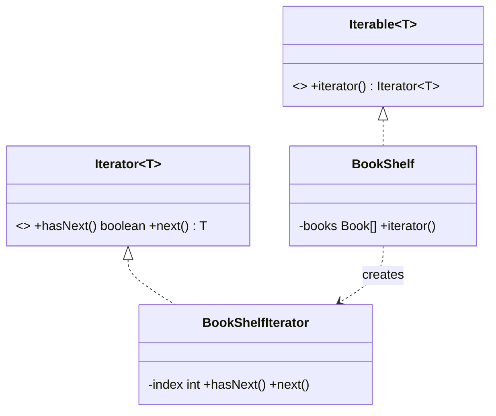
```mermaid
classDiagram
    class Iterator~T~ { <<interface>> +hasNext() boolean +next() T }
    class Iterable~T~ { <<interface>> +iterator() Iterator~T~ }
    class BookShelf { -books Book[] +iterator() }
    class BookShelfIterator { -index int +hasNext() +next() }

    Iterable <|.. BookShelf
    Iterator <|.. BookShelfIterator
    BookShelf ..> BookShelfIterator : creates
```

#### Java

```java
// ---------- A custom collection that hides its internals ----------
public class BookShelf implements Iterable<Book> {
    private Book[] books = new Book[10];         // internal representation — nobody's business
    private int count;

    public void add(Book b) {
        if (count == books.length) books = Arrays.copyOf(books, count * 2);
        books[count++] = b;
    }

    @Override
    public Iterator<Book> iterator() {           // ← Factory Method producing an Iterator
        return new Iterator<>() {
            private int index = 0;               // traversal state, independent per iterator
            @Override public boolean hasNext() { return index < count; }
            @Override public Book next() {
                if (!hasNext()) throw new NoSuchElementException();
                return books[index++];
            }
        };
    }

    // Bonus: a second traversal ORDER, same collection
    public Iterable<Book> byTitle() {
        return () -> Arrays.stream(books, 0, count)
                           .sorted(Comparator.comparing(Book::title))
                           .iterator();
    }
}

// ---------- Client: for-each works because we implemented Iterable ----------
BookShelf shelf = new BookShelf();
shelf.add(new Book("Clean Code"));
shelf.add(new Book("Refactoring"));

for (Book b : shelf) System.out.println(b);        // enhanced for = syntactic sugar over Iterator
for (Book b : shelf.byTitle()) System.out.println(b);
```

**Tree iterator (depth-first)** — shows why external iterators are useful:
```java
public Iterator<Node> depthFirst(Node root) {
    Deque<Node> stack = new ArrayDeque<>(List.of(root));
    return new Iterator<>() {
        public boolean hasNext() { return !stack.isEmpty(); }
        public Node next() {
            Node n = stack.pop();
            n.children().forEach(stack::push);
            return n;
        }
    };
}
```

#### External vs internal iterator
| | External (GoF) | Internal |
|---|---|---|
| Who drives the loop | the **client** (`while (it.hasNext())`) | the **collection** (`forEach`, streams) |
| Can pause / stop early | ✅ | only with short-circuit ops |
| Java example | `Iterator` | `Iterable.forEach()`, `Stream` |

#### ✅ When to use
- You wrote a custom data structure and want `for-each` support.
- You need multiple independent, simultaneous traversals or multiple traversal orders.
- You want to hide a complex/lazy/paginated source behind a simple loop (e.g. an iterator that fetches the next page from an API).

#### ⚠️ Traps
- **`ConcurrentModificationException`:** modifying a collection during iteration. Use `iterator.remove()`, `removeIf()`, or a concurrent collection.
- Overkill for a plain `List` — just use the JDK's.
- Stateful iterators aren't thread-safe.

**JDK:** `java.util.Iterator`, `ListIterator`, `Enumeration`, `Scanner`, `Stream`, every `for-each` loop you've ever written.

📁 *In this repo:* `src/com/java/demo/behavioural/iterator/`

---

### 15.4 Mediator

> **Intent:** Define an object that **encapsulates how a set of objects interact**, so they no longer refer to each other directly.

#### The problem
```
❌ EVERY-TO-EVERY coupling (n² connections)     ✅ STAR through a mediator (n connections)
        ┌───┐         ┌───┐                            ┌───┐     ┌───┐
        │ A │◀───────▶│ B │                            │ A │     │ B │
        └─┬─┘╲       ╱└─┬─┘                            └─┬─┘     └─┬─┘
          │   ╲     ╱   │                                └────┬────┘
          │    ╲   ╱    │              ──▶                 ┌──▼──────────┐
        ┌─▼─┐   ╳      ┌▼──┐                               │  Mediator   │
        │ C │◀─────────▶│ D │                              └──┬──────┬───┘
        └───┘          └───┘                              ┌───▼─┐  ┌─▼───┐
   add E → wire 4 more links                              │  C  │  │  D  │
   change B → touch A, C, D                               └─────┘  └─────┘
```

#### Structure
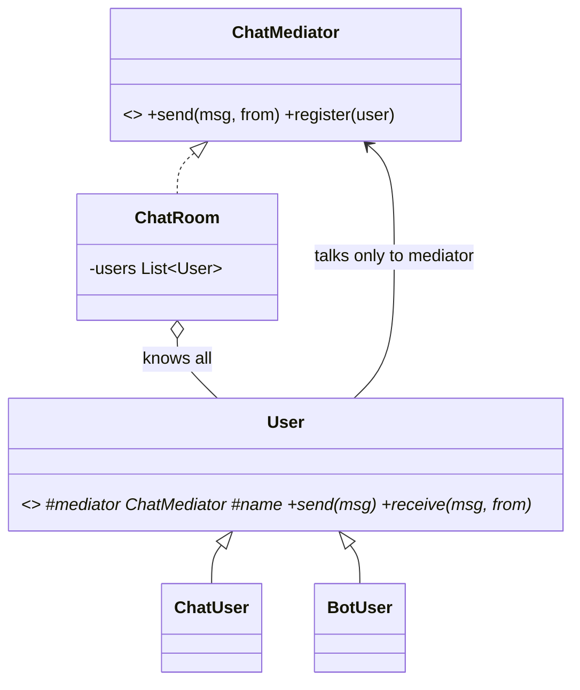
```mermaid
classDiagram
    class ChatMediator { <<interface>> +send(msg, from) +register(user) }
    class ChatRoom { -users List~User~ }
    class User { <<abstract>> #mediator ChatMediator #name +send(msg) +receive(msg, from)* }
    class ChatUser
    class BotUser

    ChatMediator <|.. ChatRoom
    User <|-- ChatUser
    User <|-- BotUser
    ChatRoom o-- User : knows all
    User --> ChatMediator : talks only to mediator
```

#### Java

```java
// ---------- Mediator ----------
public interface ChatMediator {
    void register(User user);
    void send(String message, User sender);
    void sendPrivate(String message, User sender, String toName);
}

// ---------- Concrete mediator: the ONLY place that knows the topology ----------
public class ChatRoom implements ChatMediator {
    private final Map<String, User> users = new LinkedHashMap<>();
    private final List<String> transcript = new ArrayList<>();

    @Override public void register(User user) {
        users.put(user.name(), user);
        broadcast("*** " + user.name() + " joined ***");
    }

    @Override public void send(String message, User sender) {
        transcript.add(sender.name() + ": " + message);              // moderation, logging,
        users.values().stream()                                      // filtering all live here
             .filter(u -> u != sender)
             .forEach(u -> u.receive(message, sender.name()));
    }

    @Override public void sendPrivate(String message, User sender, String toName) {
        User target = users.get(toName);
        if (target != null) target.receive("(dm) " + message, sender.name());
    }

    private void broadcast(String sys) { users.values().forEach(u -> u.receive(sys, "system")); }
}

// ---------- Colleagues: know ONLY the mediator, never each other ----------
public abstract class User {
    protected final ChatMediator mediator;
    private final String name;
    protected User(ChatMediator mediator, String name) { this.mediator = mediator; this.name = name; }
    public String name() { return name; }
    public void send(String message) { mediator.send(message, this); }
    public abstract void receive(String message, String from);
}

public class ChatUser extends User {
    public ChatUser(ChatMediator m, String name) { super(m, name); }
    @Override public void receive(String message, String from) {
        System.out.println("[" + name() + "] " + from + " → " + message);
    }
}

public class BotUser extends User {                       // reacts automatically
    public BotUser(ChatMediator m, String name) { super(m, name); }
    @Override public void receive(String message, String from) {
        if (message.contains("?")) mediator.sendPrivate("Let me look that up!", this, from);
    }
}

// ---------- Usage ----------
ChatMediator room = new ChatRoom();
User ada = new ChatUser(room, "Ada");
User linus = new ChatUser(room, "Linus");
User bot = new BotUser(room, "HelpBot");
room.register(ada); room.register(linus); room.register(bot);

ada.send("Anyone know why the build is red?");   // Linus + bot get it; Ada gets a DM back
```

#### ✅ When to use
- A set of objects communicate in complex, tangled ways ("changing one breaks three").
- UI dialogs where widgets enable/disable each other (the classic GoF example).
- Chat rooms, air-traffic control, workflow orchestration, event buses, game entity coordination.

#### ⚠️ Traps
- The mediator becomes a **god object**. Split by concern, or move to an event bus / Observer when it's really just "notify others".
- **Mediator vs Observer:** Mediator is *bidirectional coordination* with logic about who talks to whom; Observer is *one-way broadcast* — the subject doesn't care who's listening or coordinate them.

**JDK/Spring:** `java.util.Timer` (mediates tasks), `ExecutorService`, Spring's `ApplicationEventPublisher`, Spring MVC `DispatcherServlet` (mediates controllers, resolvers, views).

---

### 15.5 Memento

> **Intent:** Capture an object's internal state so it can be **restored later — without violating encapsulation**.

**Three roles: Originator (owns state) · Memento (the snapshot) · Caretaker (stores snapshots but can't read them).**

#### The problem
```
❌ Caretaker reads/writes the originator's private fields → encapsulation destroyed

✅ Originator produces an opaque snapshot; caretaker only holds it
   ┌──────────────┐  save() ──▶ ┌──────────┐  push  ┌──────────────────┐
   │  Originator  │             │ Memento  │───────▶│   Caretaker      │
   │  (Editor)    │◀── restore(m)│ (opaque) │◀──pop──│ (History stack)  │
   └──────────────┘             └──────────┘        └──────────────────┘
      knows the fields          holds a copy         can store/reorder,
                                                     CANNOT inspect
   time ──▶  [s0] [s1] [s2] [s3]
                          ▲ undo() pops back to s2
```

#### Structure
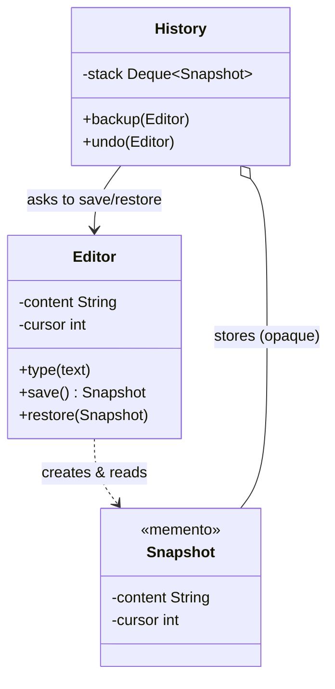
```mermaid
classDiagram
    class Editor {
        -content String
        -cursor int
        +type(text)
        +save() Snapshot
        +restore(Snapshot)
    }
    class Snapshot {
        <<memento>>
        -content String
        -cursor int
    }
    class History {
        -stack Deque~Snapshot~
        +backup(Editor)
        +undo(Editor)
    }
    Editor ..> Snapshot : creates & reads
    History o-- Snapshot : stores (opaque)
    History --> Editor : asks to save/restore
```

#### Java

```java
// ---------- Originator ----------
public class TextEditor {
    private StringBuilder content = new StringBuilder();
    private int cursor = 0;
    private String fontName = "Arial";                     // private state — stays private

    public void type(String text) { content.append(text); cursor = content.length(); }
    public void setFont(String font) { this.fontName = font; }
    public String text() { return content.toString(); }

    // ---- create a memento (only the originator can build one) ----
    public Snapshot save() {
        return new Snapshot(content.toString(), cursor, fontName);
    }

    // ---- restore from a memento (only the originator can read it) ----
    public void restore(Snapshot s) {
        this.content = new StringBuilder(s.content);
        this.cursor = s.cursor;
        this.fontName = s.fontName;
    }

    // ---- Memento: a private nested class = true encapsulation ----
    public static final class Snapshot {
        private final String content;                      // private to the outer class
        private final int cursor;
        private final String fontName;
        private final Instant takenAt = Instant.now();

        private Snapshot(String content, int cursor, String fontName) {
            this.content = content; this.cursor = cursor; this.fontName = fontName;
        }
        public Instant takenAt() { return takenAt; }       // metadata only — no state leak
    }
}

// ---------- Caretaker: stores snapshots, can't peek inside ----------
public class History {
    private final Deque<TextEditor.Snapshot> undoStack = new ArrayDeque<>();
    private final Deque<TextEditor.Snapshot> redoStack = new ArrayDeque<>();
    private static final int MAX = 100;

    public void backup(TextEditor editor) {
        undoStack.push(editor.save());
        if (undoStack.size() > MAX) undoStack.removeLast();   // bound memory
        redoStack.clear();
    }
    public void undo(TextEditor editor) {
        if (undoStack.isEmpty()) return;
        redoStack.push(editor.save());
        editor.restore(undoStack.pop());
    }
    public void redo(TextEditor editor) {
        if (redoStack.isEmpty()) return;
        undoStack.push(editor.save());
        editor.restore(redoStack.pop());
    }
}

// ---------- Usage ----------
TextEditor editor = new TextEditor();
History history = new History();

editor.type("Hello");        history.backup(editor);
editor.type(" World");       history.backup(editor);
editor.type(" — oops");
history.undo(editor);        System.out.println(editor.text());   // "Hello World"
history.undo(editor);        System.out.println(editor.text());   // "Hello"
history.redo(editor);        System.out.println(editor.text());   // "Hello World"
```

#### ✅ When to use
- Undo/redo, checkpoints, save-games, form drafts, transaction rollback, wizard "back" buttons.
- You need a snapshot but must not expose the object's fields.

#### ⚠️ Traps
- **Memory.** Full snapshots of big objects are expensive → cap the history, snapshot incrementally, or use Command's `undo()` for cheap reversible operations.
- Snapshots must be **deep** copies of mutable state, or restoring gives you the current values.
- **Memento vs Command undo:** Command replays the *inverse operation* (cheap, but every command must be invertible); Memento restores the *whole state* (simple and always correct, but heavier). Real editors combine both.

**JDK:** `java.io.Serializable` (a serialize/deserialize round-trip is a memento), `java.util.Date` (via `getTime()`/`setTime()`).

📁 *In this repo:* `src/com/java/demo/behavioural/memento/`

---

### 15.6 Observer

> **Intent:** Define a **one-to-many dependency** so that when one object changes state, all its dependents are notified automatically. (Publish/Subscribe.)

#### The problem
```
❌ Polling: "is it ready yet? is it ready yet?"  — wasteful, laggy
❌ Publisher hard-codes its listeners: adding a 4th listener edits the publisher

✅ Subscribe / notify
                                     notify()
   ┌────────────────┐   ┌───────────────┬──────────────┬──────────────┐
   │    Subject     │──▶│ EmailObserver │ SmsObserver  │ AuditObserver│
   │ (OrderService) │   └───────────────┴──────────────┴──────────────┘
   │  observers[]   │◀── subscribe() / unsubscribe()  (at RUNTIME)
   └────────────────┘
   The subject knows only the Observer INTERFACE — never the concrete listeners.
```

#### Structure
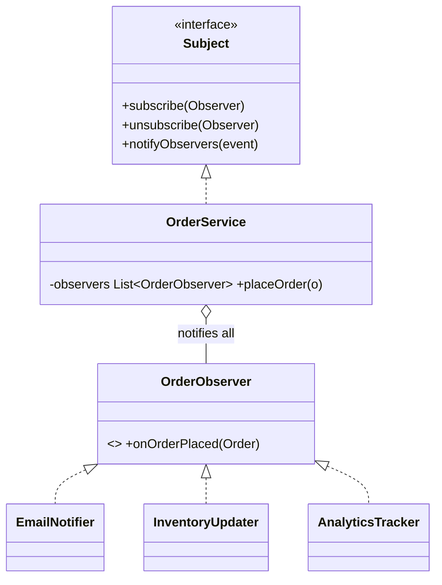
```mermaid
classDiagram
    class Subject {
        <<interface>>
        +subscribe(Observer)
        +unsubscribe(Observer)
        +notifyObservers(event)
    }
    class OrderService { -observers List~OrderObserver~ +placeOrder(o) }
    class OrderObserver { <<interface>> +onOrderPlaced(Order) }
    class EmailNotifier
    class InventoryUpdater
    class AnalyticsTracker

    Subject <|.. OrderService
    OrderObserver <|.. EmailNotifier
    OrderObserver <|.. InventoryUpdater
    OrderObserver <|.. AnalyticsTracker
    OrderService o-- OrderObserver : notifies all
```

#### Java

```java
// ---------- Observer ----------
public interface OrderObserver {
    void onOrderPlaced(Order order);
}

// ---------- Subject ----------
public class OrderService {
    // CopyOnWriteArrayList: safe to subscribe/unsubscribe while notifying
    private final List<OrderObserver> observers = new CopyOnWriteArrayList<>();

    public void subscribe(OrderObserver o)   { observers.add(o); }
    public void unsubscribe(OrderObserver o) { observers.remove(o); }

    public void placeOrder(Order order) {
        // ... core business logic: persist the order ...
        System.out.println("Order " + order.id() + " persisted");
        notifyObservers(order);
    }

    private void notifyObservers(Order order) {
        for (OrderObserver o : observers) {
            try {
                o.onOrderPlaced(order);
            } catch (RuntimeException e) {                  // one bad observer must not
                System.err.println("observer failed: " + e.getMessage());  // break the others
            }
        }
    }
}

// ---------- Concrete observers ----------
public class EmailNotifier implements OrderObserver {
    public void onOrderPlaced(Order o) { System.out.println("📧 confirmation email for " + o.id()); }
}
public class InventoryUpdater implements OrderObserver {
    public void onOrderPlaced(Order o) { System.out.println("📦 decrementing stock for " + o.id()); }
}
public class AnalyticsTracker implements OrderObserver {
    public void onOrderPlaced(Order o) { System.out.println("📊 tracked revenue " + o.total()); }
}

// ---------- Usage: add a listener without touching OrderService ----------
OrderService service = new OrderService();
service.subscribe(new EmailNotifier());
service.subscribe(new InventoryUpdater());
service.subscribe(new AnalyticsTracker());
service.placeOrder(order);
```

**Lambda version (single-method interface):**
```java
service.subscribe(o -> System.out.println("📧 email for " + o.id()));
service.subscribe(o -> metrics.increment("orders.placed"));
```

**Push vs Pull:**
```java
void onOrderPlaced(Order order);                 // PUSH: subject sends the data
void onChange(Subject source);                   // PULL: observer asks for what it needs
```
Push is simpler; pull avoids sending data nobody uses and keeps the event object stable.

#### ✅ When to use
- One change must trigger several independent reactions, and the reaction list varies.
- Event-driven systems, MVC (view observes model), reactive streams, domain events, GUI listeners, cache invalidation.

#### ⚠️ Traps
- **Memory leak (lapsed listener):** an observer that never unsubscribes keeps the subject alive. Use weak references or explicit removal.
- **Notification order is undefined** — don't rely on it.
- **Cascades:** observer A triggers subject B, which notifies C, which… → infinite loops. Guard with a re-entrancy flag.
- Synchronous notification means one slow observer blocks the business transaction — consider an async event bus.

**JDK/Spring:** `java.util.EventListener`, all Swing/AWT listeners, `Flow.Publisher`/`Subscriber` (Java 9 reactive streams), `PropertyChangeListener`, Spring `@EventListener` + `ApplicationEventPublisher`, RxJava. *(`java.util.Observer`/`Observable` were deprecated in Java 9 — say so if asked.)*

---

### 15.7 State

> **Intent:** Allow an object to **alter its behaviour when its internal state changes** — the object appears to change its class.

#### The problem
```
❌ Conditional soup, repeated in every method
   void insertCoin() {
     if (state == SOLD_OUT) ... else if (state == NO_COIN) ... else if (state == HAS_COIN) ...
   }
   void selectItem() { /* the SAME 4-branch chain again */ }
   → adding a state means editing every method. 💥

✅ One class per state; each knows its own behaviour AND its transitions
   ┌──────────┐ insertCoin ┌──────────┐ select  ┌──────────┐ dispense ┌──────────┐
   │ NoCoin   │───────────▶│ HasCoin  │────────▶│  Sold    │─────────▶│ NoCoin   │
   └──────────┘◀───────────└──────────┘         └────┬─────┘          └──────────┘
       ▲          refund                             │ if count == 0
       └─────────────────────────────────────────────▼──────┐
                                                  ┌──────────┐
                                                  │ SoldOut  │
                                                  └──────────┘
```

#### Structure
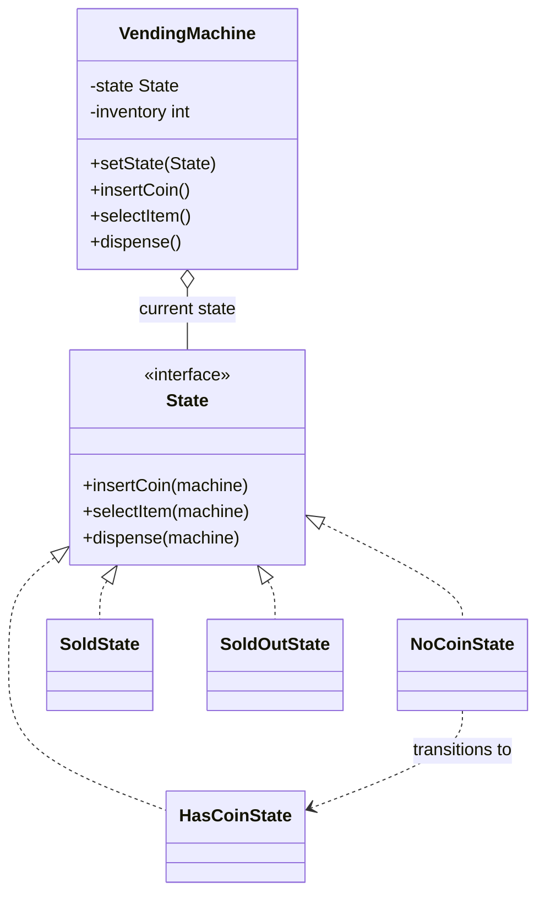
```mermaid
classDiagram
    class VendingMachine {
        -state State
        -inventory int
        +setState(State)
        +insertCoin()
        +selectItem()
        +dispense()
    }
    class State {
        <<interface>>
        +insertCoin(machine)
        +selectItem(machine)
        +dispense(machine)
    }
    class NoCoinState
    class HasCoinState
    class SoldState
    class SoldOutState

    VendingMachine o-- State : current state
    State <|.. NoCoinState
    State <|.. HasCoinState
    State <|.. SoldState
    State <|.. SoldOutState
    NoCoinState ..> HasCoinState : transitions to
```

#### Java

```java
// ---------- State ----------
public interface VendingState {
    void insertCoin(VendingMachine m);
    void selectItem(VendingMachine m);
    void dispense(VendingMachine m);
    default String name() { return getClass().getSimpleName(); }
}

// ---------- Context ----------
public class VendingMachine {
    private VendingState state;
    private int inventory;

    public VendingMachine(int inventory) {
        this.inventory = inventory;
        this.state = inventory > 0 ? new NoCoinState() : new SoldOutState();
    }

    void setState(VendingState state) { this.state = state; }     // package-private: states drive transitions
    int inventory() { return inventory; }
    void decrementInventory() { inventory--; }

    // The context just DELEGATES — zero if/else
    public void insertCoin() { state.insertCoin(this); }
    public void selectItem() { state.selectItem(this); }
    public void dispense()   { state.dispense(this); }
    public String currentState() { return state.name(); }
}

// ---------- Concrete states ----------
public class NoCoinState implements VendingState {
    public void insertCoin(VendingMachine m) { System.out.println("Coin accepted"); m.setState(new HasCoinState()); }
    public void selectItem(VendingMachine m) { System.out.println("Insert a coin first"); }
    public void dispense(VendingMachine m)   { System.out.println("Pay first"); }
}

public class HasCoinState implements VendingState {
    public void insertCoin(VendingMachine m) { System.out.println("Coin already inserted — returning it"); }
    public void selectItem(VendingMachine m) { System.out.println("Item selected"); m.setState(new SoldState()); m.dispense(); }
    public void dispense(VendingMachine m)   { System.out.println("Select an item first"); }
}

public class SoldState implements VendingState {
    public void insertCoin(VendingMachine m) { System.out.println("Please wait, dispensing"); }
    public void selectItem(VendingMachine m) { System.out.println("Already dispensing"); }
    public void dispense(VendingMachine m) {
        m.decrementInventory();
        System.out.println("🥤 Enjoy!");
        m.setState(m.inventory() > 0 ? new NoCoinState() : new SoldOutState());   // state decides the next state
    }
}

public class SoldOutState implements VendingState {
    public void insertCoin(VendingMachine m) { System.out.println("Sold out — coin returned"); }
    public void selectItem(VendingMachine m) { System.out.println("Sold out"); }
    public void dispense(VendingMachine m)   { System.out.println("Sold out"); }
}

// ---------- Usage ----------
VendingMachine m = new VendingMachine(1);
m.insertCoin();   // Coin accepted
m.selectItem();   // Item selected → 🥤 Enjoy!
m.insertCoin();   // Sold out — coin returned
```

**Compact alternative: enum-based state machine** (great for interviews when the states are few and stateless):
```java
public enum OrderState {
    CREATED   { OrderState next(Event e) { return e == Event.PAY ? PAID : this; } },
    PAID      { OrderState next(Event e) { return e == Event.SHIP ? SHIPPED : this; } },
    SHIPPED   { OrderState next(Event e) { return e == Event.DELIVER ? DELIVERED : this; } },
    DELIVERED { OrderState next(Event e) { return this; } };
    abstract OrderState next(Event e);
}
```

#### ✅ When to use
- An object behaves very differently depending on state, and you have big conditionals repeated across methods.
- Order lifecycle, vending machine, ATM, TCP connection, document workflow (draft→review→published), media player, traffic light, game character states.

#### ⚠️ Traps
- Overkill for 2 states and 1 method — a boolean is fine.
- Transition logic scattered across states can be hard to see; a transition table or diagram in comments helps.
- Creating a new state object per transition is wasteful — make stateless states singletons/enums.

#### 🎯 **State vs Strategy** (the #1 comparison question)
| | **State** | **Strategy** |
|---|---|---|
| Who chooses | the object itself, based on internal state | the **client**, explicitly |
| Do implementations know each other? | ✅ they trigger transitions | ❌ fully independent |
| Changes over time | yes, automatically | only if the client swaps it |
| Intent | model a lifecycle | swap an algorithm |
Structurally they're near-identical — the difference is *who drives the change*.

📁 *In this repo:* `src/com/java/demo/behavioural/state/`

---
### 15.8 Strategy

> **Intent:** Define a family of algorithms, encapsulate each one, and make them **interchangeable**. The algorithm varies independently of the clients that use it.

#### The problem
```
❌ One method, N algorithms, one growing switch
   double fee(String type) {
       if (type.equals("CARD"))   return amt * 0.02;
       else if (type.equals("UPI")) return 0;
       else if (type.equals("WALLET")) return amt * 0.01;   ← new method = edit this class
   }

✅ Each algorithm is its own object, injected into the context
   ┌────────────────┐   has-a   ┌──────────────────────┐
   │    Context     │──────────▶│ «PaymentStrategy»    │  pay(amount)
   │ (ShoppingCart) │           └──────────▲───────────┘
   └────────────────┘        ┌─────────────┼─────────────┐
     setStrategy(...)    CreditCard       UPI          Wallet     ← add: 1 new class, 0 edits
     at RUNTIME
```

#### Structure
```mermaid
classDiagram
    class PaymentStrategy { <<interface>> +pay(amount) boolean +name() String }
    class CreditCardStrategy
    class UpiStrategy
    class WalletStrategy
    class ShoppingCart {
        -strategy PaymentStrategy
        +setPaymentStrategy(s)
        +checkout()
    }
    PaymentStrategy <|.. CreditCardStrategy
    PaymentStrategy <|.. UpiStrategy
    PaymentStrategy <|.. WalletStrategy
    ShoppingCart o-- PaymentStrategy : delegates to
```

#### Java

```java
// ---------- Strategy ----------
public interface PaymentStrategy {
    boolean pay(BigDecimal amount);
    String name();
}

// ---------- Concrete strategies ----------
public class CreditCardStrategy implements PaymentStrategy {
    private final String cardNumber, cvv;
    public CreditCardStrategy(String cardNumber, String cvv) { this.cardNumber = cardNumber; this.cvv = cvv; }
    public boolean pay(BigDecimal amount) {
        System.out.println("💳 Charging " + amount + " to card ****" + cardNumber.substring(cardNumber.length() - 4));
        return true;
    }
    public String name() { return "CARD"; }
}

public class UpiStrategy implements PaymentStrategy {
    private final String vpa;
    public UpiStrategy(String vpa) { this.vpa = vpa; }
    public boolean pay(BigDecimal amount) { System.out.println("📲 UPI request of " + amount + " to " + vpa); return true; }
    public String name() { return "UPI"; }
}

public class WalletStrategy implements PaymentStrategy {
    private BigDecimal balance;
    public WalletStrategy(BigDecimal balance) { this.balance = balance; }
    public boolean pay(BigDecimal amount) {
        if (balance.compareTo(amount) < 0) { System.out.println("👛 Insufficient wallet balance"); return false; }
        balance = balance.subtract(amount);
        System.out.println("👛 Paid " + amount + " from wallet; left " + balance);
        return true;
    }
    public String name() { return "WALLET"; }
}

// ---------- Context ----------
public class ShoppingCart {
    private final List<Item> items = new ArrayList<>();
    private PaymentStrategy strategy;                                  // the swappable part

    public void add(Item item) { items.add(item); }
    public void setPaymentStrategy(PaymentStrategy s) { this.strategy = s; }   // change at RUNTIME

    public void checkout() {
        if (strategy == null) throw new IllegalStateException("choose a payment method");
        BigDecimal total = items.stream().map(Item::price).reduce(BigDecimal.ZERO, BigDecimal::add);
        if (strategy.pay(total)) System.out.println("✅ Order confirmed via " + strategy.name());
        else System.out.println("❌ Payment failed");
    }
}

// ---------- Usage ----------
ShoppingCart cart = new ShoppingCart();
cart.add(new Item("Book", new BigDecimal("499")));
cart.setPaymentStrategy(new UpiStrategy("ada@bank"));
cart.checkout();
cart.setPaymentStrategy(new WalletStrategy(new BigDecimal("100")));   // swapped live
cart.checkout();
```

**Lambda / functional Strategy** — for single-method strategies, skip the classes entirely:
```java
@FunctionalInterface interface DiscountStrategy { BigDecimal apply(BigDecimal amount); }

Map<String, DiscountStrategy> discounts = Map.of(
    "NONE",   amt -> amt,
    "FLAT10", amt -> amt.subtract(BigDecimal.TEN).max(BigDecimal.ZERO),
    "PCT20",  amt -> amt.multiply(new BigDecimal("0.80"))
);
BigDecimal payable = discounts.get(code).apply(total);

// The JDK does this everywhere:
list.sort(Comparator.comparing(Order::total).reversed());   // Comparator IS a Strategy
```

**Spring-style strategy registry** (very common in real code and a strong interview answer):
```java
@Service
public class PaymentService {
    private final Map<String, PaymentStrategy> strategies;
    // Spring injects every PaymentStrategy bean; index by name
    public PaymentService(List<PaymentStrategy> all) {
        this.strategies = all.stream().collect(toMap(PaymentStrategy::name, identity()));
    }
    public boolean pay(String method, BigDecimal amount) {
        return strategies.getOrDefault(method, unsupported(method)).pay(amount);
    }
}
```

#### ✅ When to use
- Multiple ways to do the same thing: payment, pricing/discount, compression, encryption, sorting, routing, retry/backoff, validation.
- You want to pick the algorithm at runtime, from config, or per-tenant.
- You have a conditional that selects behaviour rather than data.

#### ⚠️ Traps
- The client must know the strategies exist to choose one (a factory or registry hides that).
- Don't create a strategy interface for something with exactly one implementation forever (YAGNI).
- Strategies should be **stateless** if shared; otherwise make one per use.

**JDK/Spring:** `Comparator`, `ThreadPoolExecutor.RejectedExecutionHandler`, `java.util.function.*`, Spring's `PlatformTransactionManager`, `PasswordEncoder`.

📁 *In this repo:* `src/com/java/demo/behavioural/strategy/`

---

### 15.9 Template Method

> **Intent:** Define the **skeleton of an algorithm** in a base class, deferring some steps to subclasses. Subclasses redefine steps **without changing the algorithm's structure**.

#### The problem
```
❌ CsvImporter and XmlImporter both do: open → read → validate → transform → save → close
   with only 2 steps differing → 80% duplicated code

✅ Skeleton in the parent, holes filled by children
   ┌──────────────────────────────────────────────────────┐
   │ abstract DataImporter                                │
   │   final void importData() {   ← THE TEMPLATE METHOD  │
   │       openSource();      ← common (concrete)         │
   │       var raw = read();  ← ABSTRACT (subclass)       │
   │       validate(raw);     ← common                    │
   │       var d = parse(raw);← ABSTRACT (subclass)       │
   │       if (shouldAudit()) audit();  ← HOOK (optional) │
   │       save(d);           ← common                    │
   │       closeSource();     ← common                    │
   │   }                                                  │
   └──────────────────────────────────────────────────────┘
              ▲                          ▲
        CsvImporter                XmlImporter    (each supplies only read() and parse())
```

**This is the "Hollywood Principle": don't call us, we'll call you.** The framework calls your code.

#### Structure
```mermaid
classDiagram
    class DataImporter {
        <<abstract>>
        +importData() final
        #openSource()
        #read()* String
        #parse(raw)* List
        #shouldAudit() boolean
        #save(records)
    }
    class CsvImporter
    class XmlImporter
    class JsonImporter
    DataImporter <|-- CsvImporter
    DataImporter <|-- XmlImporter
    DataImporter <|-- JsonImporter
```

#### Java

```java
public abstract class DataImporter {

    // ============ THE TEMPLATE METHOD — final so nobody breaks the sequence ============
    public final ImportReport importData(Path source) {
        long t0 = System.currentTimeMillis();
        openSource(source);
        try {
            String raw = readRaw(source);                 // varies
            validate(raw);                                // common
            List<Record> records = parse(raw);            // varies
            if (shouldDeduplicate()) records = dedupe(records);   // HOOK (optional override)
            int saved = save(records);                    // common
            return new ImportReport(saved, System.currentTimeMillis() - t0);
        } finally {
            closeSource();                                // common
        }
    }
    // ==================================================================================

    // --- steps subclasses MUST supply ---
    protected abstract String readRaw(Path source);
    protected abstract List<Record> parse(String raw);

    // --- HOOK: default behaviour subclasses MAY override ---
    protected boolean shouldDeduplicate() { return false; }

    // --- common steps, shared by all ---
    protected void openSource(Path p) { System.out.println("opening " + p); }
    protected void closeSource()      { System.out.println("closed"); }
    protected void validate(String raw) {
        if (raw == null || raw.isBlank()) throw new IllegalStateException("empty source");
    }
    protected List<Record> dedupe(List<Record> in) { return new ArrayList<>(new LinkedHashSet<>(in)); }
    protected int save(List<Record> records) { System.out.println("saved " + records.size()); return records.size(); }
}

// ---------- Concrete implementations: only the differing steps ----------
public class CsvImporter extends DataImporter {
    @Override protected String readRaw(Path p) { return Files.readString(p); }
    @Override protected List<Record> parse(String raw) {
        return raw.lines().skip(1).map(line -> Record.fromCsv(line.split(","))).toList();
    }
    @Override protected boolean shouldDeduplicate() { return true; }   // opt into the hook
}

public class XmlImporter extends DataImporter {
    @Override protected String readRaw(Path p) { return Files.readString(p); }
    @Override protected List<Record> parse(String raw) { return XmlParser.parse(raw); }
}

// ---------- Usage: same call, different behaviour ----------
List<DataImporter> importers = List.of(new CsvImporter(), new XmlImporter());
importers.forEach(i -> i.importData(Path.of("data.in")));
```

#### ✅ When to use
- Several classes share the same algorithm *structure* but differ in a few steps.
- You're building a **framework** and want to give users controlled extension points.
- Test setup/teardown (JUnit), request lifecycles, ETL jobs, game turn loops, build pipelines.

#### ⚠️ Traps
- **Inheritance-based** ⇒ compile-time only, single parent, and subclasses are coupled to the parent's protected API. If you need runtime swapping, use **Strategy** instead.
- Don't make the template method non-final — a subclass overriding it defeats the whole pattern.
- Too many abstract steps = a confusing contract; keep it to 2–4.

#### 🎯 **Template Method vs Strategy**
| | Template Method | Strategy |
|---|---|---|
| Mechanism | **Inheritance** | **Composition** |
| Binding | compile time | runtime |
| Varies | *steps* of a fixed algorithm | the *whole* algorithm |
| Control | base class calls down | client injects in |

**JDK/Spring:** `AbstractList`/`AbstractMap` (implement `get`+`size`, get everything else), `InputStream.read()`, `java.util.AbstractProcessor`, JUnit's `@Before`/`@After` lifecycle, Servlet `HttpServlet.service()` dispatching to `doGet`/`doPost`, Spring's `JdbcTemplate`.

📁 *In this repo:* `src/com/java/demo/behavioural/template_method/`

---

### 15.10 Visitor

> **Intent:** Represent an **operation to be performed on the elements of an object structure**. Lets you define a new operation without changing the classes of the elements.

#### The problem
```
   You have a STABLE class hierarchy (Circle, Square, Triangle) and keep needing
   NEW OPERATIONS on it (area, export-to-XML, render, cost estimate, validation…).

❌ Add a method to every element class for every new operation
   → editing 10 shape classes for each new feature; shapes get bloated with
     unrelated concerns (XML export logic inside a geometry class?)

✅ Put each operation in its own Visitor class
   ELEMENTS (stable)                     VISITORS (grow freely)
   ┌──────────┐                          ┌─────────────────────┐
   │ Circle   │  accept(v) ─────────────▶│ AreaVisitor         │
   │ Square   │  accept(v) ─────────────▶│ XmlExportVisitor    │
   │ Triangle │  accept(v) ─────────────▶│ CostEstimateVisitor │  ← add without touching shapes
   └──────────┘                          └─────────────────────┘
```

#### Double dispatch — the mechanism to explain out loud
```
   shape.accept(visitor)          ← 1st dispatch: picks the ELEMENT type (Circle.accept)
        └─▶ visitor.visit(this)   ← 2nd dispatch: picks the VISITOR method (visit(Circle))

   Java only has single dispatch (on the receiver), so Visitor simulates
   double dispatch with two chained virtual calls.
```

#### Structure
```mermaid
classDiagram
    class Shape { <<interface>> +accept(v ShapeVisitor) R }
    class Circle
    class Rectangle
    class Group
    class ShapeVisitor {
        <<interface>>
        +visit(Circle) R
        +visit(Rectangle) R
        +visit(Group) R
    }
    class AreaVisitor
    class XmlExportVisitor

    Shape <|.. Circle
    Shape <|.. Rectangle
    Shape <|.. Group
    ShapeVisitor <|.. AreaVisitor
    ShapeVisitor <|.. XmlExportVisitor
    Circle ..> ShapeVisitor : accept() calls visit(this)
```

#### Java

```java
// ---------- Visitor (generic return type = much more useful) ----------
public interface ShapeVisitor<R> {
    R visit(Circle circle);
    R visit(Rectangle rectangle);
    R visit(Group group);
}

// ---------- Elements: each just says "visit me" ----------
public interface Shape {
    <R> R accept(ShapeVisitor<R> visitor);
}

public record Circle(double radius) implements Shape {
    public <R> R accept(ShapeVisitor<R> v) { return v.visit(this); }   // ← double dispatch
}
public record Rectangle(double w, double h) implements Shape {
    public <R> R accept(ShapeVisitor<R> v) { return v.visit(this); }
}
public record Group(List<Shape> children) implements Shape {           // Composite + Visitor
    public <R> R accept(ShapeVisitor<R> v) { return v.visit(this); }
}

// ---------- Operation #1 ----------
public class AreaVisitor implements ShapeVisitor<Double> {
    public Double visit(Circle c)    { return Math.PI * c.radius() * c.radius(); }
    public Double visit(Rectangle r) { return r.w() * r.h(); }
    public Double visit(Group g)     { return g.children().stream().mapToDouble(s -> s.accept(this)).sum(); }
}

// ---------- Operation #2: added with ZERO changes to Circle/Rectangle/Group ----------
public class SvgExportVisitor implements ShapeVisitor<String> {
    public String visit(Circle c)    { return "<circle r=\"" + c.radius() + "\"/>"; }
    public String visit(Rectangle r) { return "<rect width=\"" + r.w() + "\" height=\"" + r.h() + "\"/>"; }
    public String visit(Group g)     {
        return g.children().stream().map(s -> s.accept(this)).collect(joining("", "<g>", "</g>"));
    }
}

// ---------- Usage ----------
Shape drawing = new Group(List.of(new Circle(2), new Rectangle(3, 4),
                                  new Group(List.of(new Circle(1)))));

System.out.println(drawing.accept(new AreaVisitor()));        // 25.70
System.out.println(drawing.accept(new SvgExportVisitor()));   // <g><circle .../><rect .../><g>...</g></g>
```

**Modern Java alternative:** sealed interfaces + pattern-matching switch give you the same "add an operation" flexibility, with exhaustiveness checked by the compiler:
```java
public sealed interface Shape permits Circle, Rectangle, Group {}

double area(Shape s) {
    return switch (s) {                                    // compiler errors if a case is missing
        case Circle c    -> Math.PI * c.radius() * c.radius();
        case Rectangle r -> r.w() * r.h();
        case Group g     -> g.children().stream().mapToDouble(this::area).sum();
    };
}
```
> 🎯 Mentioning this earns points: "Visitor exists because older Java lacked exhaustive pattern matching. With sealed types I'd often prefer a switch — unless the element hierarchy is in a library I don't own."

#### ✅ When to use
- The **element hierarchy is stable**, but operations keep multiplying.
- Operations don't belong in the elements (export, reporting, metrics, static analysis).
- Compilers/AST traversal, document object models, file-system scans, rule evaluation.

#### ⚠️ Traps
- ❌ **Adding a new element type** means editing every visitor — the exact opposite trade-off from Composite. *Only use Visitor when elements are stable.*
- Visitors often need access to element internals → weakens encapsulation.
- Verbose; a lot of boilerplate for small hierarchies.

**JDK:** `java.nio.file.FileVisitor` (`Files.walkFileTree`), `javax.lang.model.element.ElementVisitor`, `javax.lang.model.type.TypeVisitor` (annotation processing), ASM's `ClassVisitor`.

📁 *In this repo:* `src/com/java/demo/behavioural/visitor/`

---

### 15.11 Interpreter

> **Intent:** Given a language, define a representation for its **grammar** plus an interpreter that uses the representation to **evaluate sentences** in the language.

*(The least-used GoF pattern — know it exists and where it applies.)*

#### The idea
```
   Expression:   (5 + 3) * 2
   Parsed into a tree of Expression objects, then interpret() walks it:

                    ┌─────────┐
                    │    ×    │  interpret() = left.interpret() * right.interpret()
                    └────┬────┘
              ┌──────────┴──────────┐
         ┌────▼────┐           ┌────▼────┐
         │    +    │           │ Num(2)  │  ← TERMINAL expression
         └────┬────┘           └─────────┘
        ┌─────┴─────┐
   ┌────▼───┐  ┌────▼───┐
   │ Num(5) │  │ Num(3) │
   └────────┘  └────────┘        result: 16
```

#### Structure
```mermaid
classDiagram
    class Expression { <<interface>> +interpret(Context) int }
    class NumberExpression { -value int }
    class AddExpression { -left -right }
    class MultiplyExpression { -left -right }
    class VariableExpression { -name String }

    Expression <|.. NumberExpression : terminal
    Expression <|.. VariableExpression : terminal
    Expression <|.. AddExpression : non-terminal
    Expression <|.. MultiplyExpression : non-terminal
    AddExpression o-- Expression : left, right (recursive)
```

#### Java

```java
// ---------- Context: variable bindings ----------
public class Context {
    private final Map<String, Integer> variables = new HashMap<>();
    public Context set(String name, int value) { variables.put(name, value); return this; }
    public int get(String name) {
        Integer v = variables.get(name);
        if (v == null) throw new IllegalStateException("undefined variable: " + name);
        return v;
    }
}

// ---------- Abstract expression ----------
public interface Expression {
    int interpret(Context ctx);
}

// ---------- Terminal expressions ----------
public record NumberExpression(int value) implements Expression {
    public int interpret(Context ctx) { return value; }
}
public record VariableExpression(String name) implements Expression {
    public int interpret(Context ctx) { return ctx.get(name); }
}

// ---------- Non-terminal expressions (recursive) ----------
public record AddExpression(Expression left, Expression right) implements Expression {
    public int interpret(Context ctx) { return left.interpret(ctx) + right.interpret(ctx); }
}
public record SubtractExpression(Expression left, Expression right) implements Expression {
    public int interpret(Context ctx) { return left.interpret(ctx) - right.interpret(ctx); }
}
public record MultiplyExpression(Expression left, Expression right) implements Expression {
    public int interpret(Context ctx) { return left.interpret(ctx) * right.interpret(ctx); }
}

// ---------- Usage:  (x + 3) * 2   with x = 5 ----------
Context ctx = new Context().set("x", 5);

Expression ast = new MultiplyExpression(
        new AddExpression(new VariableExpression("x"), new NumberExpression(3)),
        new NumberExpression(2));

System.out.println(ast.interpret(ctx));   // 16
```

**More realistic use — a boolean rule engine:**
```java
interface Rule { boolean evaluate(Customer c); }

record MinAge(int age)         implements Rule { public boolean evaluate(Customer c) { return c.age() >= age; } }
record InCountry(String code)  implements Rule { public boolean evaluate(Customer c) { return c.country().equals(code); } }
record And(Rule a, Rule b)     implements Rule { public boolean evaluate(Customer c) { return a.evaluate(c) && b.evaluate(c); } }
record Or(Rule a, Rule b)      implements Rule { public boolean evaluate(Customer c) { return a.evaluate(c) || b.evaluate(c); } }
record Not(Rule r)             implements Rule { public boolean evaluate(Customer c) { return !r.evaluate(c); } }

// eligibility = age >= 18 AND (country == "IN" OR country == "US")
Rule eligible = new And(new MinAge(18), new Or(new InCountry("IN"), new InCountry("US")));
boolean ok = eligible.evaluate(customer);
```
This is the pattern you'll genuinely use: **rules composed from small objects, editable as data/config**. (It's also the *Specification pattern*.)

#### ✅ When to use
- A simple, stable grammar you need to evaluate repeatedly: filters, search queries, pricing/discount rules, feature-flag conditions, permission expressions, formula fields.

#### ⚠️ Traps
- **One class per grammar rule** → complex grammars become unmaintainable. For anything real (SQL, a programming language), use a parser generator (ANTLR, JavaCC), not hand-written Interpreter.
- Interpreter only defines *evaluation*; you still need a **parser** to build the tree from text.

**JDK:** `java.util.regex.Pattern`, `java.text.Format`, `javax.el.ExpressionFactory` (EL), Spring Expression Language (SpEL).

---
---
# PART C — INTERVIEW PREP

## 16. Look-alike patterns — the questions that trip people up

### 16.1 The wrapper family: Adapter vs Decorator vs Proxy vs Facade
All four wrap something. **The difference is intent.**

```
   ADAPTER      client ─▶ [translates] ─▶ incompatible thing     "make it FIT"
   DECORATOR    client ─▶ [adds stuff] ─▶ same interface         "make it MORE"
   PROXY        client ─▶ [controls]   ─▶ same interface         "control ACCESS"
   FACADE       client ─▶ [simplifies] ─▶ many things            "make it SIMPLER"
```

| | Interface vs wrapped | Stackable? | Creates the target? | Purpose |
|---|---|---|---|---|
| **Adapter** | **Different** | rarely | no | Fix an incompatibility |
| **Decorator** | **Same** | ✅ designed to stack | no | Add behaviour at runtime |
| **Proxy** | **Same** | usually one | ✅ often lazily | Control access / lifecycle |
| **Facade** | **New, simpler** | no | maybe | Hide subsystem complexity |

### 16.2 Strategy vs State
Already covered in §15.7. In one line: **Strategy = the client picks the algorithm; State = the object switches itself.**

### 16.3 Factory Method vs Abstract Factory vs Builder
```
   Factory Method    → ONE product, subclass decides which concrete class
   Abstract Factory  → a FAMILY of matching products from one factory object
   Builder           → ONE complex product, assembled STEP BY STEP
```
| | Products | Focus |
|---|---|---|
| **Factory Method** | 1 | *which* class to instantiate |
| **Abstract Factory** | N related | *consistency* across a family |
| **Builder** | 1 (complex) | *how* it's constructed, step by step |

### 16.4 Composite vs Decorator
Both are recursive trees of the same interface.
- **Composite:** a node has **many** children; goal is **uniform treatment** of leaf and branch.
- **Decorator:** a node has exactly **one** child; goal is **adding behaviour**.

### 16.5 Observer vs Mediator vs Chain of Responsibility
```
   OBSERVER   1 subject ──broadcast──▶ N listeners (one-way, subject doesn't care who)
   MEDIATOR   N colleagues ◀──coordinated──▶ 1 hub (two-way, hub has logic)
   CHAIN      request ──▶ h1 ──▶ h2 ──▶ h3 (sequential, usually ONE handles it)
```

### 16.6 Template Method vs Strategy
Inheritance vs composition; compile-time vs runtime. See §15.9.

### 16.7 Command vs Strategy
Both wrap behaviour in an object.
- **Strategy:** *how* to do something (interchangeable algorithms for the same task).
- **Command:** *what* to do, plus *when* — it's a request you can store, queue, log and undo.

### 16.8 Bridge vs Strategy
Structurally identical (composition + interface). **Bridge** is a structural decision made up front to prevent a class explosion across two dimensions; **Strategy** is a behavioural decision to swap one algorithm.

### 16.9 Memento vs Prototype
Both copy state. **Memento** stores a snapshot for later *restoration of the same object*; **Prototype** copies to create a *new independent object*.

---

## 17. Pattern selection decision tree

```
START: what's actually bothering you?
│
├─ "Creating objects is messy / coupled"
│   ├─ Need exactly one instance? .......................... SINGLETON (or a DI singleton bean)
│   ├─ Too many constructor params / optional fields? ....... BUILDER
│   ├─ Which concrete class depends on input? ............... FACTORY METHOD (or simple factory)
│   ├─ Need a whole matching FAMILY of objects? ............. ABSTRACT FACTORY
│   └─ Construction is expensive & instances are similar? ... PROTOTYPE
│
├─ "Composing / structuring objects is awkward"
│   ├─ Two APIs don't match? ................................ ADAPTER
│   ├─ Too many subclasses from 2 varying dimensions? ....... BRIDGE
│   ├─ Tree of parts and wholes? ............................ COMPOSITE
│   ├─ Add behaviour at runtime, in combinations? ........... DECORATOR
│   ├─ Subsystem too complex for callers? ................... FACADE
│   ├─ Too many objects, memory blowing up? ................. FLYWEIGHT
│   └─ Need to control access / lazy-load / cache? .......... PROXY
│
└─ "Objects interact badly / behaviour is tangled"
    ├─ Multiple possible handlers, order matters? ........... CHAIN OF RESPONSIBILITY
    ├─ Need undo / queue / log of operations? ............... COMMAND (+ MEMENTO for state)
    ├─ Traverse a custom collection? ........................ ITERATOR
    ├─ Everything talks to everything? ...................... MEDIATOR
    ├─ Snapshot & restore state? ............................ MEMENTO
    ├─ "When X changes, tell Y and Z"? ...................... OBSERVER
    ├─ Behaviour depends on a lifecycle/status field? ....... STATE
    ├─ Several interchangeable algorithms? .................. STRATEGY
    ├─ Same steps, different details? ....................... TEMPLATE METHOD
    ├─ Stable classes, ever-growing operations? ............. VISITOR
    └─ Evaluating rules / expressions? ...................... INTERPRETER
```

### Smell → pattern quick map
| Code smell | Likely fix |
|---|---|
| Long `if/else` or `switch` on a type field | Strategy · State · Factory · polymorphism |
| Telescoping constructors | Builder |
| `new ConcreteX()` inside business logic | Factory + Dependency Injection |
| Duplicated algorithm skeleton | Template Method |
| Class with 20 public methods | Facade + splitting by SRP |
| `instanceof` chains in the client | Composite · Visitor · polymorphism |
| God class coordinating everything | Mediator · SRP split |
| Copy-pasted wrapper logic (logging, retry, cache) | Decorator · Proxy |
| Feature flags scattered through code | Strategy registry |
| Polling for changes | Observer |

---

## 18. Patterns hiding in the JDK & Spring

Knowing these makes your answers concrete instead of theoretical.

| Pattern | JDK | Spring / ecosystem |
|---|---|---|
| Singleton | `Runtime.getRuntime()`, `Desktop.getDesktop()` | default bean scope |
| Factory Method | `Calendar.getInstance()`, `Optional.of()`, `List.of()` | `BeanFactory`, `FactoryBean` |
| Abstract Factory | `DocumentBuilderFactory`, `SAXParserFactory` | `ApplicationContext` |
| Builder | `StringBuilder`, `HttpRequest.newBuilder()`, `Stream.Builder` | `UriComponentsBuilder`, `MockMvcBuilders` |
| Prototype | `Object.clone()`, `ArrayList.clone()` | `@Scope("prototype")` |
| Adapter | `Arrays.asList()`, `InputStreamReader` | `HandlerAdapter`, `MessageConverter` |
| Bridge | JDBC `Driver`↔`Connection` | SLF4J → Logback/Log4j |
| Composite | `java.awt.Container`, Swing components | Spring Security filter chains |
| Decorator | `BufferedInputStream`, `Collections.unmodifiableList()` | `HttpServletRequestWrapper`, `TransactionAwareDataSourceProxy` |
| Facade | `java.net.URL`, `Files` | `JdbcTemplate`, `RestTemplate`, `JmsTemplate` |
| Flyweight | `Integer.valueOf()` cache, String pool | — |
| Proxy | `java.lang.reflect.Proxy`, RMI | `@Transactional`, `@Cacheable`, `@Async`, Hibernate lazy proxies |
| Chain of Responsibility | `java.util.logging` handlers | `Filter`/`FilterChain`, Spring Security, `HandlerInterceptor` |
| Command | `Runnable`, `Callable`, `ExecutorService` | `JmsTemplate` callbacks, Spring Batch `Tasklet` |
| Iterator | `Iterator`, `Scanner`, `Stream` | `Page`/`Slice` in Spring Data |
| Mediator | `ExecutorService`, `Timer` | `DispatcherServlet`, `ApplicationEventPublisher` |
| Memento | `Serializable` round-trip | Spring Web Flow snapshots |
| Observer | `EventListener`, `Flow.Publisher` (Java 9) | `@EventListener`, `ApplicationListener`, Reactor |
| State | — | Spring State Machine |
| Strategy | `Comparator`, `RejectedExecutionHandler` | `PasswordEncoder`, `PlatformTransactionManager` |
| Template Method | `AbstractList`, `HttpServlet.service()` | `JdbcTemplate.execute()`, JUnit lifecycle |
| Visitor | `FileVisitor`, `javax.lang.model` visitors | ASM/ByteBuddy `ClassVisitor` |
| Interpreter | `Pattern` (regex), `java.text.Format` | SpEL |

---

## 19. Concurrency basics for LLD

Interviewers *will* ask "what if two users do this at the same time?"

### 19.1 The core problem
```
   Thread A: read seats=1 ──▶ check 1>0 ✔ ──▶ write seats=0   ┐
   Thread B: read seats=1 ──▶ check 1>0 ✔ ──▶ write seats=0   ┘ both booked the last seat 💥
              ↑ RACE CONDITION: read-modify-write is not atomic
```

### 19.2 Your toolkit
```java
// 1) synchronized — mutual exclusion on an object's monitor
public synchronized void book() { ... }                 // locks 'this'
synchronized (lock) { ... }                             // locks a dedicated object (better)

// 2) Atomic classes — lock-free CAS for single variables
private final AtomicInteger seats = new AtomicInteger(100);
boolean booked = seats.getAndUpdate(s -> s > 0 ? s - 1 : s) > 0;

// 3) Concurrent collections — instead of synchronizing a HashMap
Map<String, Spot> spots = new ConcurrentHashMap<>();
spots.computeIfAbsent(id, Spot::new);                   // atomic
List<Listener> ls = new CopyOnWriteArrayList<>();       // great for observer lists

// 4) ReentrantLock — when you need tryLock, timeouts, fairness or multiple conditions
private final ReentrantLock lock = new ReentrantLock();
if (lock.tryLock(500, TimeUnit.MILLISECONDS)) {
    try { ... } finally { lock.unlock(); }              // ALWAYS unlock in finally
}

// 5) ReadWriteLock — many readers, one writer
private final ReadWriteLock rw = new ReentrantReadWriteLock();

// 6) ExecutorService — never `new Thread()` in application code
ExecutorService pool = Executors.newFixedThreadPool(8);
Future<Result> f = pool.submit(() -> compute());

// 7) Immutability — the best answer of all: nothing to synchronize
public record Money(BigDecimal amount, Currency currency) { }
```

### 19.3 Thread-safe by design — what to say in an interview
```java
public class ParkingLot {
    private final Map<SpotId, Spot> spots = new ConcurrentHashMap<>();
    private final BlockingQueue<Spot> freeSpots = new LinkedBlockingQueue<>();

    // Atomic "take one free spot" — no explicit locking, no race
    public Optional<Ticket> park(Vehicle v) {
        Spot spot = freeSpots.poll();                    // atomic dequeue
        if (spot == null) return Optional.empty();       // lot full
        return Optional.of(new Ticket(v, spot, Instant.now()));
    }

    public void leave(Ticket t) { freeSpots.offer(t.spot()); }
}
```

**Checklist to mention:** identify shared mutable state → make it immutable if possible → otherwise pick the narrowest lock or a concurrent/atomic structure → watch for deadlock (always acquire locks in the same order) → prefer optimistic locking (a `version` column) at the database layer.

### 19.4 Thread-safe Singleton — see §13.1
Bill Pugh holder or `enum`. Mention `volatile` in double-checked locking; it's a classic follow-up.

---

## 20. Anti-patterns & pattern abuse

| Anti-pattern | What it looks like | Fix |
|---|---|---|
| **God object / Blob** | One class does everything (`OrderManager` with 40 methods) | Split by SRP; Facade + focused services |
| **Anemic domain model** | Entities with only getters/setters; all logic in "services" | Move behaviour onto the entity (Tell, Don't Ask) |
| **Singleton abuse** | Global mutable state everywhere; untestable | DI-managed singletons; pass dependencies in |
| **Poltergeist** | Classes that exist only to call one other class | Delete; inline |
| **Spaghetti inheritance** | 6-level `extends` chains | Favour composition |
| **Pattern-itis** | 5 patterns for a 50-line problem | KISS/YAGNI — patterns must earn their complexity |
| **Golden hammer** | "Everything is a Strategy" | Choose per problem |
| **Yo-yo problem** | Reading code means jumping up and down a deep hierarchy | Flatten; use composition |
| **Circular dependency** | A → B → A | Introduce an interface, invert one direction (DIP) |
| **Magic strings/numbers** | `if (status == 3)` | Enums, named constants |
| **Leaky abstraction** | `Repository` returning a JDBC `ResultSet` | Return domain objects |

> 🎯 **The senior signal:** saying *"I wouldn't use a pattern here — a plain method is enough."* Patterns cost indirection; spend it deliberately.

---

## 21. Classic LLD problems & which patterns they want

| Problem | Core classes | Patterns interviewers look for |
|---|---|---|
| **Parking Lot** | `ParkingLot`, `Floor`, `Spot`, `Vehicle`, `Ticket`, `FeeCalculator` | **Strategy** (pricing), **Factory** (vehicle/spot), **Singleton** (lot), Observer (display board) |
| **Elevator System** | `Elevator`, `Request`, `Scheduler`, `Button` | **State** (idle/moving/door-open), **Strategy** (scheduling: SCAN/FCFS), **Observer**, **Command** |
| **Vending Machine** | `VendingMachine`, `Inventory`, `Coin`, `Product` | **State** ⭐, Strategy (payment), Singleton |
| **Tic-Tac-Toe / Chess** | `Board`, `Piece`, `Player`, `Move`, `Game` | **Strategy** (piece movement / AI), **Factory** (pieces), **Observer** (game state), **Memento** (undo), **Command** (moves) |
| **Splitwise** | `User`, `Group`, `Expense`, `Split`, `BalanceSheet` | **Strategy** (equal/exact/percent split), **Observer** (notify), Factory |
| **BookMyShow / Ticket booking** | `Movie`, `Show`, `Screen`, `Seat`, `Booking`, `Payment` | **Strategy** (payment/pricing), **State** (booking lifecycle), **Singleton**, concurrency (seat locking) ⭐ |
| **Rate Limiter** | `RateLimiter`, `Bucket`, `Rule` | **Strategy** (token bucket / leaky bucket / sliding window), **Factory**, concurrency |
| **Notification Service** | `Notification`, `Channel`, `Template`, `Dispatcher` | **Strategy**/**Factory** (channel), **Observer**, **Decorator** (retry/throttle), **Chain of Responsibility** |
| **Logging Framework** | `Logger`, `LogLevel`, `Appender`, `Formatter` | **Chain of Responsibility** ⭐ (levels), **Strategy** (appenders), **Singleton**, **Decorator** |
| **Cache (LRU)** | `Cache`, `Node`, `EvictionPolicy` | **Strategy** (LRU/LFU/FIFO), **Observer** (eviction events), **Proxy** (caching proxy) |
| **Food delivery (Swiggy)** | `Restaurant`, `Menu`, `Order`, `Cart`, `DeliveryPartner` | **Strategy** (matching, pricing), **State** (order lifecycle), **Observer** (tracking), **Facade** |
| **Snake & Ladder** | `Board`, `Dice`, `Player`, `Jump` | **Factory**, **Strategy** (dice), **Observer** |
| **ATM** | `ATM`, `Card`, `Account`, `CashDispenser` | **State** ⭐ (idle/card-inserted/authenticated), **Chain of Responsibility** (note dispensing: 2000→500→100) |
| **Text Editor** | `Document`, `Cursor`, `Command`, `History` | **Command** + **Memento** ⭐ (undo/redo), **Flyweight** (characters), **Composite** |
| **Ride Hailing (Uber)** | `Rider`, `Driver`, `Trip`, `Matcher`, `Pricing` | **Strategy** (matching/surge), **State** (trip), **Observer** (location), **Mediator** |

**A worked mini-example — Parking Lot skeleton:**
```java
// Strategy for pricing
interface PricingStrategy { Money calculate(Duration parked, VehicleType type); }
class HourlyPricing  implements PricingStrategy { ... }
class FlatDayPricing implements PricingStrategy { ... }

// Factory for spot assignment
interface SpotAllocationStrategy { Optional<Spot> allocate(List<Spot> free, Vehicle v); }
class NearestToEntrance implements SpotAllocationStrategy { ... }

enum VehicleType { MOTORCYCLE, CAR, TRUCK }
enum SpotType    { SMALL, MEDIUM, LARGE;
    static SpotType requiredFor(VehicleType t) { return switch (t) {
        case MOTORCYCLE -> SMALL; case CAR -> MEDIUM; case TRUCK -> LARGE; }; }
}

class ParkingLot {
    private final Map<SpotType, Deque<Spot>> freeSpots = new EnumMap<>(SpotType.class);
    private final PricingStrategy pricing;
    private final SpotAllocationStrategy allocation;
    // park(), leave(), and a synchronized/atomic path for the last spot
}
```

---

## 22. One-page revision sheet

### The 4 pillars
**Encapsulation** hide data · **Abstraction** hide complexity · **Inheritance** IS-A reuse · **Polymorphism** one interface, many forms.

### SOLID
**S**RP one reason to change · **O**CP extend don't modify · **L**SP subtypes substitutable · **I**SP small interfaces · **D**IP depend on abstractions.

### The 23 patterns in one breath
> **Creational (5):** Singleton, Factory Method, Abstract Factory, Builder, Prototype.
> **Structural (7):** Adapter, Bridge, Composite, Decorator, Facade, Flyweight, Proxy.
> **Behavioural (11):** Chain of Responsibility, Command, Iterator, Mediator, Memento, Observer, State, Strategy, Template Method, Visitor, Interpreter.
>
> *Counting check:* **5 + 7 + 11 = 23**. Creational = the 5 ways to make things. Structural = **A-B-C-D-F-F-P** (Adapter, Bridge, Composite, Decorator, Facade, Flyweight, Proxy) — alphabetical, so it is easy to recall in order.

### The three GoF principles
1. Program to an **interface**, not an implementation.
2. Favour **composition** over inheritance.
3. **Encapsulate what varies.**

### Sentences to have ready
- *"I'd use Strategy here because pricing is the part that varies, and OCP says I should be able to add a rule without editing the existing ones."*
- *"Singleton gives one instance, but it's global state — in a real service I'd use a DI-managed singleton so I can still inject a fake in tests."*
- *"Adapter and Decorator look identical; the difference is intent — Adapter changes the interface, Decorator keeps it and adds behaviour."*
- *"Composite makes adding element types easy and operations hard; Visitor is the exact opposite trade-off."*
- *"This is a state machine, so I'd model each state as a class rather than repeat the same four-branch conditional in every method."*
- *"Two threads can race for the last seat, so I'd hold the seat with an atomic operation and confirm on payment with a timeout."*

### Final interview checklist
- [ ] Clarify requirements & state the scope back
- [ ] List actors and use cases
- [ ] Nouns → classes, verbs → methods
- [ ] Interfaces at every seam that varies
- [ ] Draw the class diagram with real UML arrows
- [ ] Name each pattern **and the principle it serves**
- [ ] Handle concurrency and edge cases explicitly
- [ ] State the trade-offs of your own design before they do

---

## 📚 Further reading
- [refactoring.guru/design-patterns](https://refactoring.guru/design-patterns) — the source of this taxonomy, with great illustrations
- *Design Patterns: Elements of Reusable Object-Oriented Software* — Gamma, Helm, Johnson, Vlissides (the "GoF" book)
- *Head First Design Patterns* — Freeman & Robson (the friendliest introduction)
- *Effective Java* — Joshua Bloch (Items 1, 2, 13, 17, 18, 20, 34 map directly onto this guide)
- *Clean Code* / *Clean Architecture* — Robert C. Martin (SOLID in depth)
- *Refactoring* — Martin Fowler (the smells that lead you to patterns)

---

<sub>Runnable examples for many of these patterns live in `src/com/java/demo/` in this repository.</sub>
